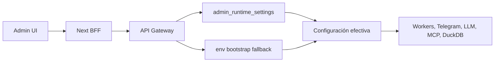

# Plan Configuración DB-First Admin

## Criterio Arquitectónico
Sí es buena práctica, pero solo con esta frontera: `.env` debe ser bootstrap técnico, no modelo de producto. La consola debe operar sobre configuración DB-first, tipada y agrupada por dominio. Cuando algo todavía dependa de variables de entorno, el Gateway puede leerlas como fallback, pero la UI no debe presentarlas como interfaz principal.

## Enfoque Recomendado
- Crear una capa `Runtime Settings` en Gateway, no extender más `/env`.
- Guardar configuración editable en DuckDB, con scope por `tenant_id` y `actor_email` cuando aplique.
- Mantener `/env` como lectura/patch legacy para compatibilidad, pero retirar su exposición principal de `/duckdb`.
- Agrupar UI por dominios: `LLM`, `Telegram`, `DuckDB`, `MCP`, `Imágenes`, `Seguridad`, `Avanzado`.
- No devolver secretos en claro. La UI solo muestra estado enmascarado y permite reemplazar valores.
- Auditar toda escritura: actor, dominio, clave, scope, timestamp y origen UI.

## Cambios Principales
- Backend:
  - Añadir módulo de dominio en `packages/shared/src/duckclaw/admin_runtime_settings.py` para DDL, lectura efectiva, escritura y masking.
  - Registrar tabla en `packages/shared/src/duckclaw/bootstrap_core.py`.
  - Añadir endpoints en `services/api-gateway/routers/admin.py`: `GET /settings/runtime`, `PATCH /settings/runtime`, opcional `POST /settings/runtime/apply`.
  - Reemplazar usos nuevos de `DUCKCLAW_ADMIN_DUCKDB_LEGACY_SCHEMAS` por setting DB-first con fallback env.

- Frontend:
  - Cambiar `apps/duckclaw-admin/src/app/(admin)/duckdb/page.tsx` para eliminar el panel “Variables .env”.
  - Crear componentes de configuración por dominio, probablemente bajo `apps/duckclaw-admin/src/components/settings/runtime/`.
  - Extender `apps/duckclaw-admin/src/services/adminService.ts` con `getRuntimeSettings` y `patchRuntimeSettings`.
  - Actualizar mensajes que hoy dicen “configura en .env” para apuntar a “Configuración”.

- Specs y tests:
  - Documentar la frontera `.env bootstrap` vs `runtime settings DB-first` en `specs/features/platform/DUCKCLAW_ADMIN_UI.md`.
  - Agregar spec específica si el alcance crece: `specs/features/platform/ADMIN_RUNTIME_SETTINGS.md`.
  - Tests backend para precedencia DB > env > default, secretos enmascarados y auditoría.
  - Tests UI estáticos para asegurar que `/duckdb` no renderiza “Variables .env” como panel principal.

## Fases Seguras
1. Introducir tabla y endpoints DB-first sin romper `/env`.
2. Migrar solo la sección DuckDB y legacy schema config.
3. Migrar LLM/API keys y textos que mencionan `.env`.
4. Migrar Telegram/MCP/ComfyUI por dominio.
5. Marcar `/env` como legacy interno y dejarlo fuera del flujo normal de usuario.

## Riesgos y Mitigación
- Riesgo: romper arranque local si se elimina `.env` demasiado pronto. Mitigación: `.env` sigue como fallback bootstrap.
- Riesgo: exponer secretos por accidente. Mitigación: write-only para secretos, lectura enmascarada, tests específicos.
- Riesgo: mezclar configuración global con tenant/user. Mitigación: columnas `scope`, `tenant_id`, `actor_email` y reglas claras de precedencia.
- Riesgo: refactor muy grande. Mitigación: migración por dominios, empezando por DuckDB donde está el problema visible.

## Decisión
Implementaría este refactor. No como edición directa de `.env`, sino como `Runtime Settings DB-first` con `.env` solo para bootstrap y compatibilidad.