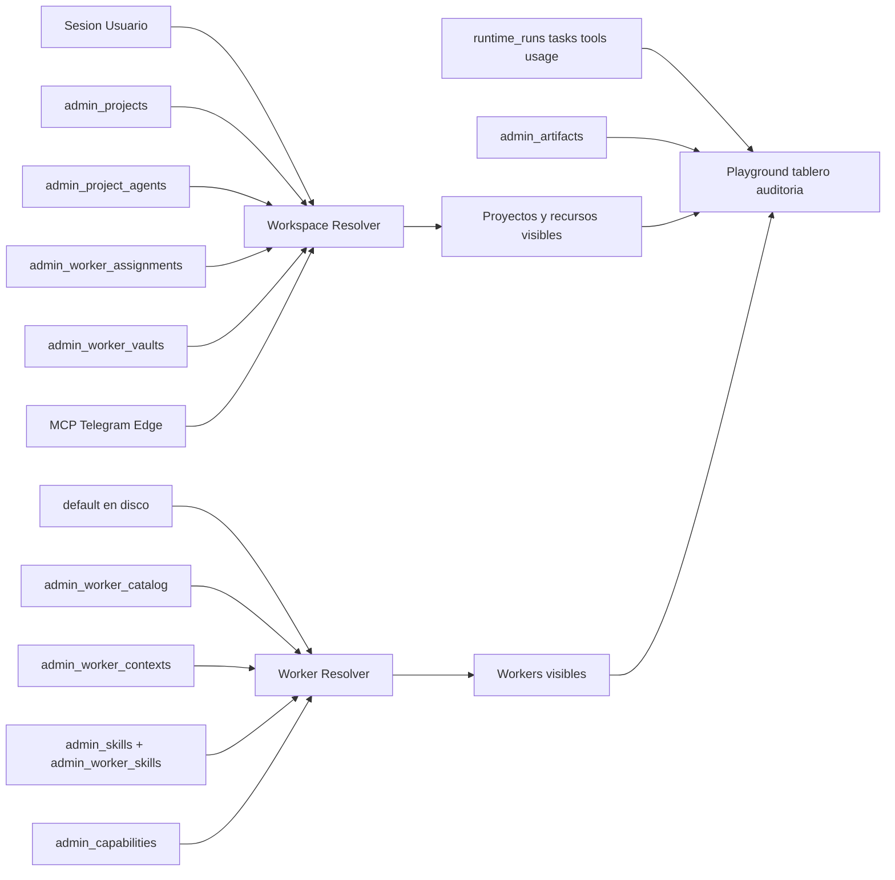

# Workspace Operativo DB-First

## Decisión Arquitectónica

Sí debemos crear una capa de workers en BD, pero no como reemplazo bruto de todo el filesystem. La regla objetivo será:

- `packages/agents/src/duckclaw/forge/templates/default` queda como único template base global para todos.
- Cualquier worker distinto de `default` deja de ser visible por defecto desde UI/Playground, aunque siga existiendo en disco.
- Los agentes personalizados viven en DuckDB con dueño, tenant, visibilidad y grants.
- Un admin puede crear, importar, asignar, actualizar, desactivar o eliminar workers del catálogo. Eliminar en UI significa desactivar o borrar registro lógico, no borrar carpetas de templates.
- Un usuario normal solo ve `default`, sus agentes privados y los que un admin le asignó.
- Los templates de otros devs quedan intactos. La importación inicial debe ser selectiva por prefijo o nombre exacto, no por lógica hardcodeada en el framework.
- El panel admin debe modelarse como workspace: usuario -> proyectos -> agentes -> conversaciones/trazas -> integraciones/canales/dispositivos.
- La BD debe ser la fuente de verdad de visibilidad, ownership, bindings y auditoría. `.env`, YAML, JSONL y filesystem quedan como inputs legacy o runtime, no como control plane principal.
- Todo proceso agéntico debe tener un run raíz auditable y trazable: entrada, plan, subtareas, tools, artifacts, costos, errores y retries.
- Las capabilities deben ser un contrato uniforme, no una mezcla implícita de `manifest.yaml`, skills Python, MCP, sandbox, ComfyUI y flags de red.



## Mapa Sidebar -> Bounded Contexts

El sidebar actual está definido en `[apps/duckclaw-admin/src/config/adminNav.ts](apps/duckclaw-admin/src/config/adminNav.ts)`. De ahí salen los bounded contexts que deben tener persistencia clara:

- Operación: `Overview`, `Playground`, `Tablero`, `Auditoría`.
- Agentes: `Workers`, `Proyectos`, `MCP`, `Skills`, `Gen Image`.
- Datos: `DuckDB`, `Runtime overrides`.
- Integraciones: `Telegram`, `Edge devices`.
- Seguridad: `Usuarios y roles`.
- Sistema avanzado: `Settings`, `Train`, `VNC`.

Diseño recomendado por Clean Architecture:

- `services/api-gateway/routers/admin.py`: capa HTTP delgada.
- `packages/shared/src/duckclaw/admin_workspace.py`: casos de uso de proyectos, conversaciones, trazas y bindings.
- `packages/shared/src/duckclaw/admin_worker_catalog.py`: catálogo, contextos, skills y permisos de workers.
- `packages/shared/src/duckclaw/admin_integrations.py`: MCP, Telegram bots y edge devices.
- `packages/shared/src/duckclaw/admin_capabilities.py`: contrato uniforme de capabilities, policies, cuotas y health.
- `packages/shared/src/duckclaw/admin_runtime.py`: ledger de runs, tasks, executions, usage, schedules, approvals y evals.
- `packages/shared/src/duckclaw/admin_artifacts.py`: artifacts, lineage, lifecycle, previews y retención.
- Migraciones `scripts/migrations/004_*` o una migración agrupada con DDL idempotente.

## Modelo de Datos

Agregar migración nueva, por ejemplo `[scripts/migrations/004_admin_worker_catalog.py](scripts/migrations/004_admin_worker_catalog.py)`, y módulo compartido `[packages/shared/src/duckclaw/admin_worker_catalog.py](packages/shared/src/duckclaw/admin_worker_catalog.py)`.

Tablas propuestas:

- `main.admin_worker_catalog`: registro canónico del worker/agente. Campos clave: `worker_uid`, `worker_id`, `display_name`, `owner_email`, `tenant_id`, `visibility`, `source_kind`, `source_template_id`, `manifest_json`, `files_json`, `active`, timestamps.
- `main.admin_worker_assignments`: asignaciones explícitas. Campos clave: `worker_uid`, `target_email`, `target_tenant_id`, `permission` (`use`, `edit`, `admin`), `assigned_by`, timestamps.
- `main.admin_worker_vaults`: archivos DuckDB anexados desde UI. Campos clave: `vault_id`, `owner_email`, `tenant_id`, `worker_uid`, `db_path`, `label`, `read_only`, `active`.
- `main.admin_worker_contexts`: contextos `.md` versionables y ordenables por worker. Campos clave: `context_id`, `worker_uid`, `title`, `content_md`, `sort_order`, `active`, timestamps.
- `main.admin_skills`: catálogo de skills reutilizables. Campos clave: `skill_id`, `name`, `description`, `skill_type`, `implementation_ref`, `owner_email`, `tenant_id`, `visibility`, `active`, timestamps.
- `main.admin_worker_skills`: relación N:N entre workers y skills. Campos clave: `worker_uid`, `skill_id`, `enabled`, `config_json`, `sort_order`.
- `main.admin_projects`: proyectos del usuario/tenant. Campos clave: `project_id`, `owner_email`, `tenant_id`, `name`, `description`, `status`, `visibility`, timestamps.
- `main.admin_project_members`: usuarios asignados a proyectos. Campos clave: `project_id`, `email`, `role`, `assigned_by`, timestamps.
- `main.admin_project_agents`: relación N:N proyecto-agente. Campos clave: `project_id`, `worker_uid`, `role`, `sort_order`, `active`.
- `main.admin_conversations`: conversaciones por usuario/proyecto/agente/canal. Campos clave: `conversation_id`, `tenant_id`, `owner_email`, `project_id`, `worker_uid`, `channel`, `channel_thread_id`, `title`, `status`, timestamps.
- `main.admin_conversation_messages`: mensajes normalizados. Campos clave: `message_id`, `conversation_id`, `role`, `content`, `content_json`, `token_count`, timestamps.
- `main.admin_agent_traces`: trazas de ejecución por conversación/agente. Campos clave: `trace_id`, `conversation_id`, `worker_uid`, `provider`, `model`, `status`, `latency_ms`, `usage_json`, `error`, timestamps.
- `main.admin_artifacts`: artefactos generados por agentes, imagen o archivos. Campos clave: `artifact_id`, `tenant_id`, `owner_email`, `project_id`, `worker_uid`, `conversation_id`, `kind`, `storage_path`, `metadata_json`, timestamps.
- `main.admin_mcp_servers`: servidores MCP administrados. Campos clave: `mcp_server_id`, `owner_email`, `tenant_id`, `name`, `transport`, `command_or_url`, `config_json`, `status`, `visibility`, timestamps.
- `main.admin_mcp_tools`: tools descubiertas por servidor MCP. Campos clave: `mcp_tool_id`, `mcp_server_id`, `name`, `description`, `schema_json`, `active`.
- `main.admin_worker_mcp_bindings`: relación N:N agente-MCP/tool. Campos clave: `worker_uid`, `mcp_server_id`, `mcp_tool_id`, `permission`, `config_json`, `active`.
- `main.admin_telegram_bots`: N bots Telegram por usuario/tenant. Campos clave: `bot_id`, `owner_email`, `tenant_id`, `bot_username`, `token_secret_ref`, `webhook_url`, `status`, timestamps.
- `main.admin_channel_routes`: rutas canal->proyecto/agente. Campos clave: `route_id`, `channel`, `bot_id`, `external_chat_id`, `tenant_id`, `project_id`, `worker_uid`, `active`.
- `main.admin_edge_devices`: dispositivos edge registrados. Campos clave: `device_id`, `owner_email`, `tenant_id`, `project_id`, `name`, `device_type`, `status`, `metadata_json`, timestamps.
- `main.admin_edge_telemetry`: lecturas/eventos edge. Campos clave: `event_id`, `device_id`, `worker_uid`, `metric`, `value_json`, `observed_at`, `ingested_at`.
- `main.admin_capabilities`: registry uniforme de capacidades disponibles. Campos clave: `capability_id`, `name`, `kind`, `provider`, `description`, `schema_json`, `risk_level`, `requires_secret`, `requires_network`, `active`.
- `main.admin_worker_capabilities`: relación N:N agente-capability. Campos clave: `worker_uid`, `capability_id`, `permission`, `config_json`, `quota_json`, `policy_json`, `enabled`.
- `main.admin_project_capabilities`: overrides por proyecto. Campos clave: `project_id`, `capability_id`, `policy_json`, `enabled`.
- `main.runtime_runs`: ejecución raíz por request. Campos clave: `run_id`, `tenant_id`, `owner_email`, `project_id`, `worker_uid`, `conversation_id`, `trigger_kind`, `input_hash`, `status`, timestamps.
- `main.runtime_tasks`: subtareas/plan items. Campos clave: `task_id`, `run_id`, `parent_task_id`, `assigned_worker_uid`, `title`, `status`, `priority`, `sort_order`.
- `main.runtime_executions`: intentos concretos de ejecución. Campos clave: `execution_id`, `task_id`, `attempt`, `status`, `retry_reason`, `error_code`, `error_message`, `duration_ms`, timestamps.
- `main.runtime_tool_calls`: llamadas a tools/capabilities. Campos clave: `tool_call_id`, `execution_id`, `capability_id`, `tool_name`, `args_redacted_json`, `args_hash`, `result_summary`, `status`, `latency_ms`.
- `main.runtime_usage`: uso y costos. Campos clave: `usage_id`, `run_id`, `execution_id`, `provider`, `model`, `prompt_tokens`, `completion_tokens`, `total_tokens`, `cost_estimate`, `currency`.
- `main.runtime_schedules`: schedules normalizados. Campos clave: `schedule_id`, `owner_email`, `tenant_id`, `project_id`, `worker_uid`, `kind`, `cron_expr`, `delta_seconds`, `timezone`, `next_run_at`, `active`.
- `main.runtime_queue_messages`: ledger de cola/dedupe. Campos clave: `message_id`, `queue_name`, `dedupe_key`, `payload_hash`, `status`, `delivery_attempts`, `locked_until`, timestamps.
- `main.runtime_approvals`: human-in-the-loop. Campos clave: `approval_id`, `run_id`, `requested_by`, `assigned_to`, `action`, `payload_redacted_json`, `decision`, `decided_by`, `expires_at`, `consumed_at`.
- `main.runtime_evals`: evaluaciones de runs/agentes/modelos. Campos clave: `eval_id`, `project_id`, `worker_uid`, `dataset_id`, `status`, `score_json`, timestamps.
- `main.runtime_eval_items`: resultados por caso. Campos clave: `eval_item_id`, `eval_id`, `input_ref`, `expected_ref`, `actual_ref`, `score_json`, `error`.
- `main.runtime_datasets`: datasets versionados para entrenamiento/eval. Campos clave: `dataset_id`, `owner_email`, `tenant_id`, `name`, `kind`, `storage_path`, `version`, `lineage_json`.
- `main.admin_knowledge_sources`: fuentes RAG por proyecto/agente. Campos clave: `source_id`, `owner_email`, `tenant_id`, `project_id`, `worker_uid`, `kind`, `uri`, `checksum`, `status`, `metadata_json`.
- `main.admin_knowledge_chunks`: chunks indexables. Campos clave: `chunk_id`, `source_id`, `content_hash`, `content_preview`, `embedding_model`, `vector_ref`, `metadata_json`.
- `main.admin_prompt_versions`: versiones de prompts/contextos. Campos clave: `prompt_version_id`, `worker_uid`, `context_id`, `version`, `content_hash`, `content_md`, `created_by`, `change_note`.
- `main.admin_model_profiles`: perfiles de modelo. Campos clave: `model_profile_id`, `owner_email`, `tenant_id`, `name`, `provider`, `model`, `params_json`, `budget_policy_json`, `active`.
- `main.admin_worker_model_bindings`: modelo por agente/proyecto. Campos clave: `worker_uid`, `project_id`, `model_profile_id`, `purpose`, `priority`, `active`.
- `main.admin_secret_refs`: referencias a secretos. Campos clave: `secret_ref`, `owner_email`, `tenant_id`, `provider`, `purpose`, `env_key`, `status`, `rotated_at`.
- `main.admin_resource_policies`: políticas reutilizables. Campos clave: `policy_id`, `owner_email`, `tenant_id`, `name`, `resource_kind`, `policy_json`, `active`.
- `main.admin_resource_tags`: tags para búsqueda/organización. Campos clave: `resource_kind`, `resource_id`, `tag`, `created_by`, `created_at`.
- `main.admin_resource_events`: event stream auditado para cambios de recursos. Campos clave: `event_id`, `tenant_id`, `actor_email`, `resource_kind`, `resource_id`, `event_type`, `payload_redacted_json`, `created_at`.
- `main.admin_quotas`: límites por tenant/proyecto/agente/capability. Campos clave: `quota_id`, `scope_kind`, `scope_id`, `metric`, `limit_value`, `window_seconds`, `active`.
- `main.admin_webhooks`: webhooks salientes/entrantes. Campos clave: `webhook_id`, `owner_email`, `tenant_id`, `project_id`, `url_secret_ref`, `event_filter_json`, `active`.
- `main.admin_notifications`: notificaciones al usuario/admin. Campos clave: `notification_id`, `target_email`, `tenant_id`, `kind`, `title`, `body`, `status`, `created_at`, `read_at`.

Mantener `main.admin_user_agents` durante transición, pero tratarla como compatibilidad. El catálogo nuevo será la fuente de verdad para permisos y visibilidad.

```mermaid
erDiagram
  ADMIN_CONSOLE_USERS ||--|| ADMIN_USER_PROFILES : has_profile
  ADMIN_USER_PROFILES ||--o{ ADMIN_WORKER_CATALOG : owns
  ADMIN_USER_PROFILES ||--o{ ADMIN_PROJECTS : owns_projects
  ADMIN_PROJECTS ||--o{ ADMIN_PROJECT_AGENTS : has_agents
  ADMIN_WORKER_CATALOG ||--o{ ADMIN_PROJECT_AGENTS : works_in_projects
  ADMIN_PROJECTS ||--o{ ADMIN_CONVERSATIONS : has_conversations
  ADMIN_WORKER_CATALOG ||--o{ ADMIN_CONVERSATIONS : handles
  ADMIN_CONVERSATIONS ||--o{ ADMIN_CONVERSATION_MESSAGES : contains
  ADMIN_CONVERSATIONS ||--o{ ADMIN_AGENT_TRACES : produces_traces
  ADMIN_CONVERSATIONS ||--o{ ADMIN_ARTIFACTS : creates_artifacts
  ADMIN_WORKER_CATALOG ||--o{ ADMIN_WORKER_ASSIGNMENTS : assigned_to
  ADMIN_WORKER_CATALOG ||--o{ ADMIN_WORKER_VAULTS : uses_vaults
  ADMIN_WORKER_CATALOG ||--o{ ADMIN_WORKER_CONTEXTS : has_contexts
  ADMIN_WORKER_CATALOG ||--o{ ADMIN_WORKER_SKILLS : links_skills
  ADMIN_SKILLS ||--o{ ADMIN_WORKER_SKILLS : reused_by
  ADMIN_CAPABILITIES ||--o{ ADMIN_WORKER_CAPABILITIES : granted_to_workers
  ADMIN_WORKER_CATALOG ||--o{ ADMIN_WORKER_CAPABILITIES : uses_capabilities
  ADMIN_PROJECTS ||--o{ ADMIN_PROJECT_CAPABILITIES : overrides_capabilities
  ADMIN_CAPABILITIES ||--o{ ADMIN_PROJECT_CAPABILITIES : scoped_by_project
  ADMIN_MCP_SERVERS ||--o{ ADMIN_MCP_TOOLS : exposes_tools
  ADMIN_WORKER_CATALOG ||--o{ ADMIN_WORKER_MCP_BINDINGS : uses_mcp
  ADMIN_MCP_SERVERS ||--o{ ADMIN_WORKER_MCP_BINDINGS : bound_to_workers
  ADMIN_USER_PROFILES ||--o{ ADMIN_TELEGRAM_BOTS : owns_bots
  ADMIN_TELEGRAM_BOTS ||--o{ ADMIN_CHANNEL_ROUTES : routes_channels
  ADMIN_PROJECTS ||--o{ ADMIN_CHANNEL_ROUTES : receives_channel
  ADMIN_WORKER_CATALOG ||--o{ ADMIN_CHANNEL_ROUTES : handles_channel
  ADMIN_USER_PROFILES ||--o{ ADMIN_EDGE_DEVICES : owns_devices
  ADMIN_EDGE_DEVICES ||--o{ ADMIN_EDGE_TELEMETRY : emits
  ADMIN_CONVERSATIONS ||--o{ RUNTIME_RUNS : starts_runs
  ADMIN_WORKER_CATALOG ||--o{ RUNTIME_RUNS : executes_runs
  RUNTIME_RUNS ||--o{ RUNTIME_TASKS : plans_tasks
  RUNTIME_TASKS ||--o{ RUNTIME_EXECUTIONS : attempts
  RUNTIME_EXECUTIONS ||--o{ RUNTIME_TOOL_CALLS : calls_tools
  ADMIN_CAPABILITIES ||--o{ RUNTIME_TOOL_CALLS : invoked_as
  RUNTIME_RUNS ||--o{ RUNTIME_USAGE : measures_usage
  RUNTIME_RUNS ||--o{ RUNTIME_APPROVALS : requests_approval
  RUNTIME_RUNS ||--o{ ADMIN_ARTIFACTS : produces_artifacts
  ADMIN_PROJECTS ||--o{ ADMIN_KNOWLEDGE_SOURCES : owns_knowledge
  ADMIN_KNOWLEDGE_SOURCES ||--o{ ADMIN_KNOWLEDGE_CHUNKS : chunks
  ADMIN_WORKER_CONTEXTS ||--o{ ADMIN_PROMPT_VERSIONS : versions
  ADMIN_MODEL_PROFILES ||--o{ ADMIN_WORKER_MODEL_BINDINGS : selected_by_workers
  ADMIN_WORKER_CATALOG ||--o{ ADMIN_WORKER_MODEL_BINDINGS : uses_models
  ADMIN_RESOURCE_POLICIES ||--o{ ADMIN_WORKER_CAPABILITIES : applies_policy
  ADMIN_SECRET_REFS ||--o{ ADMIN_MCP_SERVERS : configures_mcp
  ADMIN_SECRET_REFS ||--o{ ADMIN_TELEGRAM_BOTS : configures_bot

  ADMIN_WORKER_CATALOG {
    string worker_uid PK
    string worker_id
    string display_name
    string owner_email
    string tenant_id
    string visibility
    string source_kind
    string source_template_id
    json manifest_json
    json files_json
    boolean active
  }

  ADMIN_WORKER_CONTEXTS {
    string context_id PK
    string worker_uid
    string title
    string content_md
    int sort_order
    boolean active
  }

  ADMIN_SKILLS {
    string skill_id PK
    string name
    string description
    string skill_type
    string implementation_ref
    string owner_email
    string tenant_id
    string visibility
    boolean active
  }

  ADMIN_WORKER_SKILLS {
    string worker_uid
    string skill_id
    boolean enabled
    json config_json
    int sort_order
  }

  ADMIN_WORKER_ASSIGNMENTS {
    string worker_uid
    string target_email
    string target_tenant_id
    string permission
    string assigned_by
  }

  ADMIN_WORKER_VAULTS {
    string vault_id PK
    string owner_email
    string tenant_id
    string worker_uid
    string db_path
    string label
    boolean read_only
    boolean active
  }

  ADMIN_PROJECTS {
    string project_id PK
    string owner_email
    string tenant_id
    string name
    string status
    string visibility
  }

  ADMIN_PROJECT_AGENTS {
    string project_id
    string worker_uid
    string role
    int sort_order
    boolean active
  }

  ADMIN_CONVERSATIONS {
    string conversation_id PK
    string tenant_id
    string owner_email
    string project_id
    string worker_uid
    string channel
    string status
  }

  ADMIN_CONVERSATION_MESSAGES {
    string message_id PK
    string conversation_id
    string role
    string content
    json content_json
    int token_count
  }

  ADMIN_AGENT_TRACES {
    string trace_id PK
    string conversation_id
    string worker_uid
    string provider
    string model
    string status
    int latency_ms
    json usage_json
  }

  ADMIN_MCP_SERVERS {
    string mcp_server_id PK
    string owner_email
    string tenant_id
    string name
    string transport
    string command_or_url
    json config_json
    string visibility
    string status
  }

  ADMIN_TELEGRAM_BOTS {
    string bot_id PK
    string owner_email
    string tenant_id
    string bot_username
    string token_secret_ref
    string webhook_url
    string status
  }

  ADMIN_EDGE_DEVICES {
    string device_id PK
    string owner_email
    string tenant_id
    string project_id
    string name
    string device_type
    string status
  }

  ADMIN_CAPABILITIES {
    string capability_id PK
    string name
    string kind
    string provider
    json schema_json
    string risk_level
    boolean requires_secret
    boolean requires_network
    boolean active
  }

  ADMIN_WORKER_CAPABILITIES {
    string worker_uid
    string capability_id
    string permission
    json config_json
    json quota_json
    json policy_json
    boolean enabled
  }

  RUNTIME_RUNS {
    string run_id PK
    string tenant_id
    string owner_email
    string project_id
    string worker_uid
    string conversation_id
    string trigger_kind
    string status
  }

  RUNTIME_TASKS {
    string task_id PK
    string run_id
    string parent_task_id
    string assigned_worker_uid
    string title
    string status
    int priority
  }

  RUNTIME_EXECUTIONS {
    string execution_id PK
    string task_id
    int attempt
    string status
    string retry_reason
    int duration_ms
  }

  RUNTIME_TOOL_CALLS {
    string tool_call_id PK
    string execution_id
    string capability_id
    string tool_name
    json args_redacted_json
    string args_hash
    string status
    int latency_ms
  }

  ADMIN_KNOWLEDGE_SOURCES {
    string source_id PK
    string owner_email
    string tenant_id
    string project_id
    string worker_uid
    string kind
    string uri
    string checksum
    string status
  }

  ADMIN_MODEL_PROFILES {
    string model_profile_id PK
    string owner_email
    string tenant_id
    string name
    string provider
    string model
    json params_json
    json budget_policy_json
    boolean active
  }

  ADMIN_SECRET_REFS {
    string secret_ref PK
    string owner_email
    string tenant_id
    string provider
    string purpose
    string env_key
    string status
  }
```



## Extensibilidad Relacional

Para que añadir nuevas tablas sea fácil y no genere parches rápidos, toda entidad nueva debe seguir un contrato mínimo:

- Identidad estable: `<entity>_id` o clave compuesta clara.
- Ownership: `tenant_id`, `owner_email` y, cuando aplique, `project_id`/`worker_uid`.
- Estado: `active`, `status`, `created_at`, `updated_at`, `deleted_at` si hay soft delete.
- Seguridad: nunca guardar secretos en claro; usar `secret_ref`.
- Auditoría: emitir fila en `admin_resource_events` para cambios relevantes.
- Búsqueda: permitir `admin_resource_tags`.
- Políticas: reutilizar `admin_resource_policies` y `admin_quotas` en vez de columnas ad hoc.
- APIs: helpers `ensure_*_table`, `upsert_*`, `get_*`, `list_*_for_actor`, `deactivate_*`.
- Tests: idempotencia de DDL, aislamiento por tenant, RBAC y no exposición cross-tenant.

Este patrón permite sumar nuevos dominios, por ejemplo billing, webhooks, datasets externos o dispositivos, sin modificar el resolver central salvo para registrar el nuevo tipo de recurso.

## Reglas de Cardinalidad

- Un usuario puede tener N proyectos.
- Un proyecto puede tener N agentes trabajando.
- Un agente puede estar en N proyectos si el dueño o admin lo permite.
- Un agente puede tener N conversaciones.
- Una conversación pertenece a un canal: `web`, `telegram`, `mcp`, `edge`, `api` u otro.
- Una conversación puede tener N mensajes y N trazas.
- Un usuario/tenant puede tener N MCP servers, N bots Telegram y N edge devices.
- Un agente puede usar N MCP/tools y una tool puede estar asignada a N agentes.
- Un proyecto puede tener N rutas de canal, por ejemplo varios bots Telegram apuntando a distintos agentes.
- Un agente puede tener N capabilities, y una capability puede reutilizarse en N agentes.
- Un run puede tener N tasks; cada task puede tener N executions por retry.
- Cada execution puede producir N tool calls y N artifacts.
- Usage/costos se agregan por execution, run, conversation, project, worker, tenant y usuario.

## CapabilityDescriptor

Cada skill, MCP tool, bridge, sandbox, workflow de imagen o permiso sensible debe normalizarse como `CapabilityDescriptor`:

- `kind`: `local_skill`, `mcp_tool`, `sandbox`, `comfyui`, `network`, `duckdb`, `filesystem`, `telegram`, `edge_device`, `llm_provider`.
- `provider`: módulo, servidor MCP, runtime o servicio externo.
- `schema_json`: contrato de entrada/salida, compatible con validación Pydantic/JSON Schema.
- `risk_level`: `low`, `medium`, `high`, `critical`.
- `requires_secret`: indica si necesita token/API key.
- `requires_network`: indica si necesita salida de red.
- `policy_json`: límites por agente/proyecto: dominios permitidos, modo read-only, tamaño máximo, timeout, tasa, cuotas.
- `audit_policy`: `none`, `summary`, `full_redacted`.

Esto evita que la autorización dependa de strings dispersos en manifests. El `WorkerResolver` debe entregar el agente con sus capabilities ya filtradas por sesión, proyecto y rol.

Capabilities faltantes que conviene modelar desde el inicio:

- `llm_inference`: proveedores/modelos, parámetros, presupuesto y fallback.
- `rag_search`: búsqueda sobre `admin_knowledge_sources`, VSS o DuckDB.
- `sql_read` y `sql_write`: acceso DuckDB, siempre con política separada.
- `filesystem_read` y `filesystem_write`: rutas permitidas, tamaño máximo y sandbox.
- `network_fetch`: dominios permitidos y modo de extracción.
- `mcp_tool`: tool schema, server, permisos y health.
- `telegram_send` y `telegram_receive`: bots, chats y rate limits.
- `edge_command` y `edge_telemetry`: comandos y lecturas por device.
- `image_generate` y `image_edit`: workflows, cuotas y artifact policy.
- `code_sandbox`: runtime, red, timeout, memoria y artifact outputs.
- `human_approval`: acciones que requieren aprobación.

## Runtime Ledger

El runtime debe dejar evidencia relacional de cada proceso agéntico:

- `runtime_runs`: una solicitud de usuario, cron, Telegram, MCP o edge trigger.
- `runtime_tasks`: plan o DAG de subtareas.
- `runtime_executions`: intentos reales, incluyendo retries.
- `runtime_tool_calls`: llamadas a capabilities con argumentos redactados y hashes para idempotencia.
- `runtime_usage`: tokens, modelo, proveedor y costo estimado.
- `runtime_approvals`: acciones que requieren intervención humana.
- `runtime_schedules`: reemplazo progresivo de schedules guardados como JSON en `agent_config`.
- `runtime_queue_messages`: dedupe, intentos y estado de entrega para procesos asíncronos.
- `runtime_evals`, `runtime_eval_items`, `runtime_datasets`: evaluación y entrenamiento versionados.

Este ledger no reemplaza Redis ni LangSmith. Redis sigue como transporte/estado caliente; LangSmith puede seguir como observabilidad externa. DuckDB queda como verdad local consultable y auditable.

## Artifact Registry

`admin_artifacts` debe ser genérico y no solo imagen:

- `kind`: `image`, `document`, `csv`, `json`, `pdf`, `notebook`, `audio`, `video`, `model`, `dataset`, `trace`, `report`.
- `storage_backend`: `local_fs`, `duckdb_blob`, `s3_compatible`, `external_url`.
- `storage_path`: ruta o URI.
- `content_type`, `size_bytes`, `sha256`.
- `lineage_json`: run/tool/dataset/capability que lo produjo.
- `retention_policy`, `expires_at`, `deleted_at`.
- `visibility`, `owner_email`, `tenant_id`, `project_id`, `worker_uid`, `conversation_id`.

La vista de artifacts debe listar, filtrar, paginar, previsualizar, descargar, desactivar y aplicar garbage collection sin permitir acceso cross-tenant.

Artifacts que conviene cubrir desde el primer diseño:

- Conversación exportada o resumida.
- Reporte técnico/financiero/legal en Markdown/PDF.
- Imagen generada o editada.
- Dataset SFT/eval/GRPO.
- Notebook o script producido por sandbox.
- CSV/Parquet/JSON de análisis.
- Captura o evidencia de edge device.
- Resultado MCP externo.
- Snapshot de memoria/RAG.
- Trace empaquetado para depuración.

## Cambios Backend

Actualizar los puntos que hoy leen templates desde disco:

```1648:1675:services/api-gateway/routers/admin.py
@router.get("/templates", dependencies=[Depends(_require_admin_key)])
async def list_templates() -> dict[str, Any]:
    from duckclaw.workers.factory import list_workers
    from duckclaw.workers.manifest import load_manifest
    # ... actualmente lista todo templates/workers
```

```196:224:services/api-gateway/routers/admin.py
def _playground_workers_payload(raw_workers: list[str]) -> dict[str, Any]:
    """Normaliza equipo Playground: ids canónicos en disco + etiquetas de manifest."""
    from duckclaw.workers.manifest import load_manifest
    from duckclaw.workers.template_registry import list_template_ids, resolve_template_id
```

Plan de backend:

- Crear un `WorkspaceResolver` en `admin_workspace.py` que derive proyectos, agentes, conversaciones e integraciones visibles desde sesión.
- Crear un `WorkerResolver` o helpers en `admin_worker_catalog.py` que devuelvan workers visibles según sesión: `default + owned + assigned`.
- Cambiar `/templates` para que no exponga todos los directorios en disco. Solo debe exponer `default` y entradas permitidas del catálogo.
- Cambiar `/playground/config` para usar el resolver DB-first, no `list_template_ids()` global.
- Cambiar `/playground/chat` para validar `worker_id` contra workers visibles del actor antes de ejecutar.
- Añadir endpoints admin/usuario: listar catálogo, crear worker desde `default`, importar worker existente, asignar/desasignar, actualizar metadata/prompts/contextos/skills, desactivar/eliminar lógicamente.
- Añadir endpoint para anexar DuckDB desde UI con validación de path bajo raíces permitidas (`db/private/...` o directorio runtime aprobado), guardándolo en `admin_worker_vaults`.
- Separar responsabilidades: el router FastAPI solo orquesta HTTP; `admin_worker_catalog.py` contiene casos de uso; el resolver no debe leer headers de cliente; la capa de ejecución recibe un worker ya autorizado.
- Reemplazar gradualmente persistencia de proyectos en `forge/projects/<slug>/project.yaml` por `admin_projects` y `admin_project_agents`. El filesystem queda como export/import o compatibilidad.
- Normalizar conversaciones/trazas de `Redis`, `api_conversation`, `telegram_conversation`, JSONL y `task_audit_log` hacia `admin_conversations`, `admin_conversation_messages` y `admin_agent_traces` sin romper las fuentes existentes.
- Migrar MCP desde YAML hacia registry en `admin_mcp_servers`, manteniendo YAML como seed/import.
- Migrar rutas Telegram desde `.env` hacia `admin_telegram_bots` y `admin_channel_routes`, manteniendo secretos como referencias (`token_secret_ref`) y no como texto plano en DuckDB.
- Registrar edge devices y telemetría en tablas dedicadas; el `db-writer` debe aceptar un evento tipado para telemetría edge si hay escrituras runtime.
- Insertar eventos del runtime ledger desde puntos de ejecución ya existentes: Playground, Telegram inbound, crons, manager graph, sandbox, ComfyUI, MCP y db-writer.
- Registrar tool calls con argumentos redactados por defecto. Los valores completos solo deben persistirse cuando la capability lo permita y no sean secretos/PII.
- Agregar una capa pequeña de repositorios para facilitar nuevas tablas relacionales: cada entidad nueva debe tener `ensure_*_table`, `upsert_*`, `list_*_for_actor`, tests de idempotencia y aislamiento.
- Crear `admin_resource_events`, `admin_resource_tags`, `admin_resource_policies`, `admin_secret_refs` y `admin_quotas` como tablas transversales para evitar repetir columnas/políticas en cada dominio.
- Registrar knowledge sources y prompt versions antes de ejecutar agentes DB-backed, porque son parte central del contexto que determina respuestas.

## Migración de Templates Existentes

Crear una herramienta de migración controlada y no destructiva:

- Escanear `packages/agents/src/duckclaw/forge/templates/*`.
- Ignorar `default` porque seguirá como template base global.
- Ignorar templates de otros devs salvo que se pasen explícitamente por CLI. No borrar, mover ni renombrar carpetas.
- Importar solo templates seleccionados por prefijo o nombre exacto cuando el admin lo indique. El importador no debe conocer nombres privados del owner.
- Importar cada template seleccionado al catálogo con `visibility='private'` y `owner_email` configurable.
- Guardar `manifest.yaml`, prompts y archivos relevantes en `manifest_json/files_json`.
- Convertir archivos `.md` relevantes en filas de `admin_worker_contexts`, manteniendo título, orden y contenido completo.
- Registrar skills declaradas por manifest/config en `admin_skills` y `admin_worker_skills` para permitir reutilizarlas en uno o varios agentes.
- Después de validar, la UI/Playground dejarán de listar esos templates desde disco aunque sigan físicamente ahí.

Esto protege tus agentes personalizados sin tocar el trabajo de otro dev ni exigir borrar carpetas.

## UI Admin

Actualizar `[apps/duckclaw-admin/src/services/adminService.ts](apps/duckclaw-admin/src/services/adminService.ts)` y páginas relacionadas:

- Selector de Playground: mostrar solo `default`, propios y asignados.
- Proyectos: pasar de carpetas locales a CRUD DB-first con relación N:N proyecto-agentes.
- Playground: crear/retomar conversaciones persistidas por proyecto/agente/canal.
- Auditoría: mostrar trazas normalizadas y eventos por usuario/proyecto/agente, no solo JSONL aislado.
- Vista Admin Workers: CRUD de catálogo, asignaciones, vaults, contextos `.md` y skills.
- Flujo usuario: “Crear mi agente” clona conceptualmente desde `default`, guarda N contextos/prompts en BD, asocia N skills reutilizables y opcionalmente anexa un DuckDB propio.
- Flujo admin: importar worker, asignarlo a usuarios/tenants, revocar acceso.
- Editor de contexto: permite añadir varios documentos `.md` por agente, reordenarlos, activar/desactivar cada contexto y versionar cambios sin mezclar todo en un único prompt gigante.
- Editor de skills: permite crear una skill una vez y asociarla a uno o varios agentes con configuración específica por relación.
- MCP: administrar servidores, tools descubiertas y bindings por agente/proyecto.
- Telegram: administrar N bots y rutas por chat/canal hacia proyecto/agente.
- Edge devices: registrar dispositivos, ver estado y últimas métricas por proyecto/agente.
- Gen Image: persistir artefactos en `admin_artifacts` con owner, proyecto, conversación y worker.
- Capabilities: vista de capabilities por agente/proyecto con estado, permisos, cuotas, secretos requeridos y health.
- Runtime: vista filtrable de runs/tasks/tool calls/costos/retries para depurar procesos largos.
- Artifacts: galería/registro universal con filtros por tipo, proyecto, agente, conversación, fecha y estado de retención.
- Evals/Datasets: vista futura para datasets, golden sets, evaluaciones y comparación de modelos/agentes.
- Knowledge: fuentes RAG, estado de indexación, chunks y checksums por proyecto/agente.
- Models: perfiles de modelo y presupuesto por agente/proyecto.
- Policies/Quotas: límites operativos por capability, usuario, proyecto o agente.
- Notifications/Webhooks: eventos importantes del runtime, approvals, fallos y completions.

## Seguridad y Permisos

Reglas clave:

- `user`: puede crear/editar sus propios workers privados y anexar vaults propios.
- `admin`: puede administrar catálogo, asignaciones, imports, vaults, contextos y skills.
- Nadie puede usar un `worker_id` que no aparezca en su resolver de sesión.
- No confiar en headers de cliente para `owner_email`, `tenant_id` o `role`; derivar desde sesión BFF/Gateway.
- Los paths de DuckDB anexados deben validarse y abrirse en modo `read_only=True` salvo operación explícita del writer.
- La UI no debe ofrecer “borrar carpeta template”. Las operaciones destructivas sobre filesystem quedan fuera de alcance.
- Secretos de MCP, Telegram y edge devices no se guardan en claro. DuckDB almacena `secret_ref`; el valor real vive en `.env`, vault local o secret manager futuro.
- Todo endpoint debe validar `tenant_id`, `project_id`, `worker_uid`, `bot_id`, `mcp_server_id` y `device_id` contra el workspace visible de la sesión.
- Capabilities de alto riesgo (`filesystem`, `network`, `sandbox`, `telegram_send`, `db_write`) requieren policy explícita y auditoría.
- Artifacts deben validar tenant desde sesión/perfil, no desde `tenantId` arbitrario en URL.
- Usage y costos deben registrarse sin prompt completo salvo que la política de auditoría lo permita.
- Knowledge sources deben registrar checksum y lineage para evitar reindexar contenido duplicado.
- Prompt/context changes deben versionarse para poder explicar por qué cambió el comportamiento de un agente.
- Quotas deben aplicarse antes de ejecutar capabilities costosas o riesgosas.

## Pruebas

Agregar pruebas enfocadas:

- `default` es visible para cualquier usuario autenticado.
- Un template en disco distinto de `default` no aparece en `/templates` ni `/playground/config`.
- Usuario A no puede listar ni ejecutar worker privado de Usuario B.
- Admin puede asignar worker a Usuario B y desde ese momento B puede verlo/usarlo.
- Anexar DuckDB desde UI registra el vault sin exponerlo a otros tenants.
- Un agente puede tener N contextos `.md` activos y el resolver los entrega en orden estable.
- Una skill puede asociarse a múltiples agentes y un agente puede tener múltiples skills.
- Migración selectiva de templates es idempotente y no borra carpetas.
- Templates de otros devs permanecen intactos y ocultos salvo import explícito.
- Usuario puede tener N proyectos y cada proyecto N agentes.
- Cada agente/proyecto puede tener N conversaciones persistidas y N trazas consultables.
- Usuario A no puede acceder a conversaciones, traces, MCP, bots, edge devices ni artefactos de Usuario B.
- Admin puede asignar un agente a un proyecto/usuario sin transferir ownership.
- MCP server privado no aparece ni puede invocarse desde agente no autorizado.
- Bot Telegram solo enruta al proyecto/agente configurado para su tenant.
- Edge telemetry queda asociada a device/proyecto/tenant y no cruza tenants.
- Capability no asignada a un agente no puede ejecutarse aunque exista como skill/MCP en disco.
- Tool call registra `args_hash`, redacción de secretos y artifact lineage.
- Retry crea nueva fila en `runtime_executions` sin sobreescribir intentos previos.
- Schedule normalizado dispara run con dedupe key estable.
- Approval bloquea una action sensible hasta decisión explícita.
- Artifact privado de Usuario A no puede previsualizarse por Usuario B aunque conozca `artifact_id`.
- Runtime usage se agrega por proyecto/agente/conversación para control de costos.
- Prompt/context edit crea versión nueva sin perder la anterior.
- Knowledge source duplicada por checksum no reindexa si no cambió.
- Quota agotada bloquea capability antes de llamar proveedor externo.
- Secret ref inexistente marca capability como no saludable.
- Resource event se escribe al crear/asignar/desactivar proyecto, agente, MCP, bot, device, artifact o policy.

## Orden de Implementación

1. Extender spec con workspace operativo: proyectos, agentes, conversaciones, traces, MCP, Telegram, edge devices, capabilities, runtime ledger, artifacts, knowledge, prompts, model profiles, secrets, quotas y policies.
2. Crear migración DB-first para tablas de workspace, worker catalog, integraciones, capabilities, runtime ledger, artifacts y recursos transversales.
3. Implementar módulos compartidos `admin_workspace.py`, `admin_worker_catalog.py`, `admin_integrations.py`, `admin_capabilities.py`, `admin_runtime.py`, `admin_artifacts.py` y `admin_resources.py`.
4. Cambiar endpoints de listado/validación para filtrar por sesión y resolver permisos centralmente.
5. Añadir endpoints de CRUD/asignación/vaults/contextos/skills/proyectos/conversaciones/integraciones/capabilities/artifacts/runtime.
6. Actualizar UI y `adminService` por secciones del sidebar.
7. Crear migrador genérico y selectivo de templates sin tocar carpetas.
8. Agregar pruebas unitarias e integración.
9. Instrumentar puntos críticos para escribir runtime ledger de forma incremental.
10. Ejecutar verificación local de auth/playground/catalog/workspace/runtime.

## Riesgos

- El runtime actual carga muchos workers desde filesystem; si se intenta ejecutar un worker 100% DB-backed sin resolver/materializar, puede fallar. La primera versión debe materializar el worker runtime en `.duckclaw/runtime/agents/<tenant>/<worker_id>` o adaptar el loader con cuidado.
- Hay endpoints legacy de `/templates/{worker_id}` que hoy permiten leer/editar archivos globales. Deben quedar restringidos a admin y al catálogo permitido.
- La migración debe ocultar en UI primero. No debe borrar templates del disco, porque pueden pertenecer a otro dev o servir como respaldo.
- Si los contextos `.md` crecen demasiado, el resolver debe preparar contexto de forma ordenada y medible para evitar prompts gigantes sin control.
- Crear demasiadas tablas sin boundaries claros puede generar otro monolito de datos. Por eso se agrupan en bounded contexts: workspace, worker catalog, integrations, capabilities, runtime, artifacts y resources.
- Migrar todo de una vez puede romper UI existente. La implementación debe introducir tablas y resolvers primero, luego mover cada sección del sidebar de forma incremental.
- Los secretos de bots/MCP no deben migrarse como texto plano; solo referencias seguras.
- Un ledger demasiado detallado puede crecer rápido. Deben existir índices por `tenant_id`, `project_id`, `worker_uid`, `conversation_id`, `created_at`, y políticas de retención/archivado.
- Redactar mal tool args puede filtrar PII o secretos. La política por capability debe definir qué campos se guardan, hashean o descartan.
- Costos estimados pueden ser incorrectos si el proveedor no devuelve pricing. Guardar moneda, fuente de pricing y timestamp de cálculo.