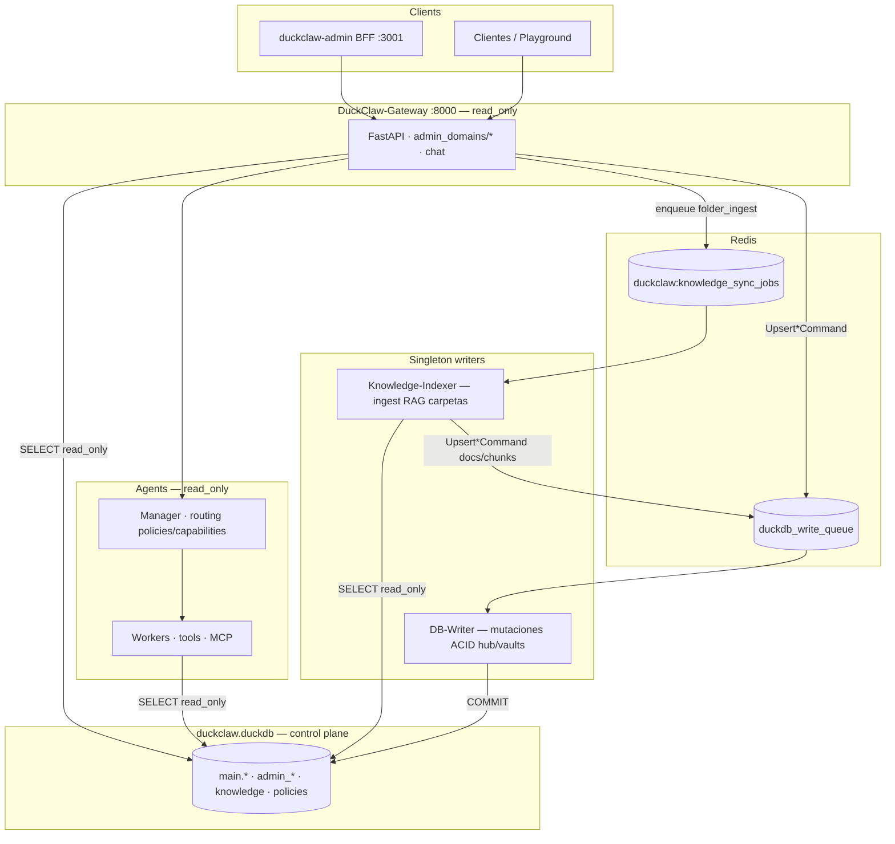

# DuckClaw

Plataforma multi-agente **DB-first**: DuckDB es el *control plane* (workers, políticas, proyectos, runtime, RAG, conectores MCP). El **API Gateway** y los **agentes** leen en `read_only=True`; las mutaciones van por **comandos tipados** → cola Redis → **DB-Writer** (singleton ACID).

Core genérico LangGraph/LangChain — sin verticales hardcodeadas en Python. Multi-tenant · Windows / Linux / macOS · Spec-driven (`docs/specs/`).

---

## Arquitectura DB-first (canonical)

**Fuente de verdad:** [`docs/specs/features/platform/DB_FIRST_CORE_REFACTOR.md`](docs/specs/features/platform/DB_FIRST_CORE_REFACTOR.md)

### Una bóveda, un schema

| Concepto | Valor canónico |
|----------|----------------|
| **Hub DuckDB** | `db/private/default/duckclaw.duckdb` |
| **Env** | `DUCKCLAW_GATEWAY_DB_PATH=db/private/default/duckclaw.duckdb` |
| **Schema SQL** | Solo `main` (+ schemas internos DuckDB: `information_schema`, `pg_catalog`) |
| **Migraciones** | `packages/shared/src/duckclaw/schema_migrations.py` — **33 versiones** (`uv run duckclaw-migrate`) |
| **Bootstrap** | `bootstrap_core.py` — DDL idempotente **sin `ALTER TABLE ADD COLUMN`** |

Tablas de homeostasis/meditate viven en **`main.homeostasis_targets`** y **`main.meditate_runs`** (migración M033). El paquete Python `harness_core/` es código Meditate/Heartbeat — **no** es un schema DuckDB separado.

**No usar:** `db/duckclaw.duckdb` (legacy en raíz), `db/system.duckdb`, `db/telegram.duckdb`, bóvedas `axis.duckdb` (legacy). Fresh start: `bash scripts/fresh_dev_platform.sh`. Migrar legacy: `bash scripts/migrate_legacy_axis_vault.sh`.

### Procesos y quién escribe



| Proceso PM2 | Rol | Escribe DuckDB |
|-------------|-----|----------------|
| **DuckClaw-Gateway** | HTTP, admin API, chat, encola comandos | ❌ `read_only=True` |
| **DuckClaw-DB-Writer** | Consume `duckdb_write_queue` | ✅ único writer habitual |
| **DuckClaw-Knowledge-Indexer** | Consume `duckclaw:knowledge_sync_jobs`, escanea vaults Obsidian | ❌ encola writes al DB-Writer |
| **DuckClaw-Heartbeat** | Ticks proactivos / homeostasis | ❌ encola deltas |
| **duckclaw-admin** | Next.js BFF → gateway (secretos solo server-side) | ❌ |

Specs de límites: [`GATEWAY_PROCESS_BOUNDARIES.md`](docs/specs/features/platform/GATEWAY_PROCESS_BOUNDARIES.md) · [`GATEWAY_DB_WRITER_BOUNDARIES.md`](docs/specs/features/platform/GATEWAY_DB_WRITER_BOUNDARIES.md)

### Reglas que no negociar

| Regla | Detalle |
|-------|---------|
| **Quién escribe** | Solo **DB-Writer** en rutas normales. Gateway/agentes/indexer: `read_only=True`. |
| **Cómo mutar** | `duckclaw.write_commands` (Pydantic) → `enqueue_write_command` / `enqueue_typed_command` → DB-Writer → `write_handlers/*`. |
| **Dónde vive la verdad** | Tablas `main.admin_*`, `prompt_policy_registry`, knowledge, grants — no Markdown runtime ni `if worker_id == "…"`. |
| **Verticales** | Quant, Finanz, PQRSD, Leila/Telegram bot legacy, etc. **fuera del core** (extensiones opt-in). |
| **Telegram** | Integración opt-in; no arranca con el stack core. Ver Integraciones en admin. |
| **Airbag framework** | 4 policies con fallback en código (`FRAMEWORK_POLICY_PACK`); el resto exige fila en DB. |
| **RAG carpetas** | Gateway **solo encola**; ingest pesado en `DuckClaw-Knowledge-Indexer` + progreso Redis `duckclaw:knowledge_sync_status:{job_id}`. |

Contrato cola/ledger: [`DB_WRITER_CONTRACT.md`](docs/specs/features/platform/DB_WRITER_CONTRACT.md)

### Control plane en el hub

| Dominio | Tablas / owners |
|---------|-----------------|
| **Identidad admin** | `admin_console_users`, `admin_user_profiles`, `admin_user_agents` |
| **Workers** | `admin_worker_catalog`, contexts, capabilities, skills, assignments |
| **Políticas** | `prompt_policy_registry`, `worker_prompt_bindings`, `worker_runtime_policies` |
| **Proyectos** | `admin_projects`, `admin_project_agents`, members |
| **Runtime** | `admin_runtime_settings` (tenant, chat, gateway, LLM, secrets) |
| **RAG** | `admin_knowledge_sources`, documents, chunks — [`RAG_TRANSVERSAL_DB_FIRST.md`](docs/specs/features/platform/RAG_TRANSVERSAL_DB_FIRST.md) |
| **Memoria semántica** | `main.semantic_memory` (context injection / VLM — distinto del RAG admin) |
| **Homeostasis** | `main.homeostasis_targets`, `main.meditate_runs` |
| **MCP** | `admin_mcp_connectors`, `admin_worker_mcp_grants` |
| **Kanban / informes** | `admin_kanban_*`, `admin_report_*` |
| **HITL** | `code_decisions`, `agent_uncertainty_log` |

Bóvedas por usuario/tenant (Memoria Triple SQL+PGQ+VSS): [`MULTI_VAULT_SYSTEM.md`](docs/specs/features/platform/MULTI_VAULT_SYSTEM.md) — opcional; el hub canónico basta para admin + playground.

### Admin API

Rutas bajo `/api/v1/admin` → `services/api-gateway/routers/admin_domains/*` (un módulo por dominio). Mutaciones = comando tipado → Redis → DB-Writer. **Código nuevo no va a god-routers.**

---

## Inicio rápido

```bash
# macOS / Linux — prereqs + migrate + PM2 + admin
./duckops-up.sh
# o
uv run duckops up
```

Variables mínimas en `.env`:

```bash
DUCKCLAW_GATEWAY_DB_PATH=db/private/default/duckclaw.duckdb
DUCKCLAW_GATEWAY_URL=http://127.0.0.1:8000
REDIS_URL=redis://localhost:6379/0
DUCKCLAW_ADMIN_API_KEY=...
DUCKCLAW_ADMIN_EMAIL=...
DUCKCLAW_ADMIN_PASSWORD=...
```

Diagnóstico: `uv run duckops doctor` · Migraciones: `uv run duckclaw-migrate` · Fresh vault: `bash scripts/fresh_dev_platform.sh`

Guía: [`docs/GETTING_STARTED.md`](docs/GETTING_STARTED.md) · Comandos: [`docs/COMANDOS.md`](docs/COMANDOS.md)

---

## Admin UI

```bash
pnpm admin:install   # primera vez
pnpm admin:dev       # http://localhost:3001
pnpm dev:local       # gateway + db-writer + admin
```

Stack PM2: `uv run duckops stack deploy` (Gateway, DB-Writer, Knowledge-Indexer, Heartbeat).

Spec UI: [`docs/specs/features/platform/DUCKCLAW_ADMIN_UI.md`](docs/specs/features/platform/DUCKCLAW_ADMIN_UI.md) · Patrones: [`UIUX-PATTERNS.md`](UIUX-PATTERNS.md)

---

## Estructura del repo

```
duckclaw/
├── packages/
│   ├── shared/     # schema_migrations, write_commands, admin_* readers, knowledge_sync_queue
│   ├── agents/     # manager, workers, forge/rag, commands, MCP bridge
│   ├── core/       # bindings C++ / performance
│   └── duckops/    # CLI: up, init, doctor, stack deploy
├── services/
│   ├── api-gateway/       # FastAPI · admin_domains/* · chat
│   ├── db-writer/         # consumidor singleton duckdb_write_queue
│   ├── knowledge-indexer/   # consumidor duckclaw:knowledge_sync_jobs
│   └── heartbeat/         # ticks proactivos
├── apps/duckclaw-admin/   # Next.js BFF
├── harness_core/          # Python Meditate/homeostasis (tablas en main.*)
├── docs/specs/            # SDD — leer antes de tocar packages/ o services/
└── tests/                 # guardrails DB-first
```

---

## Imports Python (puntos de entrada)

```python
from duckclaw import DuckClaw
from duckclaw.gateway_db import get_gateway_db_path
from duckclaw.schema_migrations import run_pending_migrations, verify_migration_integrity
from duckclaw.db_write_queue import enqueue_typed_command
from duckclaw.write_commands import UpsertWorkerCommand, CreateKnowledgeSourceCommand
from duckclaw.workers import WorkerFactory, list_workers
from duckclaw.prompt_policies import PromptPolicyResolver
from duckclaw.forge.rag import build_knowledge_context, search_knowledge
from duckclaw.knowledge_sync_queue import enqueue_knowledge_sync_job, get_job_status
```

---

## Tests

```bash
uv run pytest tests/ -m "not integration" \
  --ignore tests/run_singleton_writer_pipeline.py \
  --ignore tests/deprecated
```

Guardrails: `test_forge_legacy_cleanup.py` · `test_db_first_guardrails_static.py` · `test_schema_migrations.py` · `test_knowledge_sync_queue.py`

---

## Documentación

| Qué | Dónde |
|-----|--------|
| **Arquitectura DB-first** | [`DB_FIRST_CORE_REFACTOR.md`](docs/specs/features/platform/DB_FIRST_CORE_REFACTOR.md) |
| Handoff agentes / estado sesión | [`docs/HANDOFF_AGENT_CONTEXT.md`](docs/HANDOFF_AGENT_CONTEXT.md) |
| Índice docs | [`docs/README.md`](docs/README.md) |
| Specs plataforma | [`docs/specs/features/platform/README.md`](docs/specs/features/platform/README.md) |
| Patrones UI admin | [`UIUX-PATTERNS.md`](UIUX-PATTERNS.md) |

---

Built by [IoTCoreLabs](https://iotcorelabs.io)
