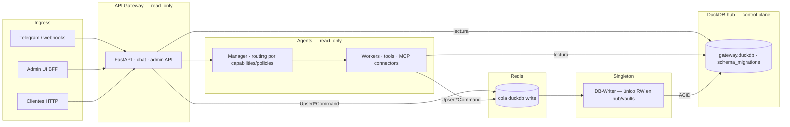

# DuckClaw

Plataforma multi-agente **DB-first**: DuckDB es el *control plane* (workers, políticas, proyectos, runtime, RAG, conectores MCP). El **API Gateway** y los **agentes** leen en `read_only=True`; las mutaciones van por **comandos tipados** → cola Redis → **DB-Writer** (singleton ACID).

Core genérico LangGraph/LangChain — sin verticales hardcodeadas en Python. Multi-tenant · Windows / Linux / macOS · Spec-driven (`docs/specs/`).

**Fuente de verdad de arquitectura:** [`docs/specs/features/platform/DB_FIRST_CORE_REFACTOR.md`](docs/specs/features/platform/DB_FIRST_CORE_REFACTOR.md)

---

## Inicio rápido

**Un comando, sin instalar nada antes** (instala `uv` automáticamente si falta):

```powershell
# Windows — doble clic en install.cmd en el Explorador de archivos
# o en terminal:
install.cmd
```

```bash
# macOS / Linux / WSL
./duckops-up.sh
```

Si ya tienes `uv` en PATH:

```bash
uv run duckops up          # prereqs + migrate + PM2 + admin
```

`duckops up` instala en el paso 1: **uv**, **Redis**, **Node**, **pnpm**, **PM2** y ejecuta **`uv sync`** (crea `.venv` con todas las deps Python).

Alternativa manual:

```bash
uv run duckops init        # wizard de configuración
uv run duckops serve --gateway
```

Diagnóstico: `uv run duckops doctor` · `uv run duckclaw-healthcheck`  
Migraciones hub: `uv run duckclaw-migrate`  
Operación (Redis, PM2, Telegram): [`docs/COMANDOS.md`](docs/COMANDOS.md)

Guía paso a paso: [`docs/GETTING_STARTED.md`](docs/GETTING_STARTED.md)

---

## Arquitectura DB-first (resumen)



### Reglas que no negociar

| Regla | Detalle |
|-------|---------|
| **Quién escribe** | Solo **DB-Writer** en rutas normales. Gateway/agentes: `read_only=True`. |
| **Cómo mutar** | `duckclaw.write_commands` (Pydantic) → `enqueue_typed_command` → DB-Writer → `write_command_handlers`. |
| **Dónde vive la verdad** | Tablas `main.admin_*`, `prompt_policy_registry`, knowledge, grants — no Markdown runtime ni `if worker_id == "…"`. |
| **Verticales** | Quant, Finanz, PQRSD, Job Hunter, War Room, etc. **fuera del core** (extensiones o config DB creada por el usuario). |
| **Airbag framework** | Solo 4 policies con fallback en código (`FRAMEWORK_POLICY_PACK`); el resto falla claro si falta fila en DB. |

Contrato cola/ledger: [`docs/specs/features/platform/DB_WRITER_CONTRACT.md`](docs/specs/features/platform/DB_WRITER_CONTRACT.md)

### Control plane en el hub (`gateway.duckdb`)

Migraciones versionadas en `packages/shared/src/duckclaw/schema_migrations.py` (actualmente **v27**). Piezas principales:

| Dominio | Tablas / owners |
|---------|-----------------|
| **Workers** | `admin_worker_catalog`, contexts, capabilities, skills, assignments |
| **Políticas** | `prompt_policy_registry`, `worker_prompt_bindings`, `tool_policy_directives`, `worker_runtime_policies` |
| **Proyectos** | `admin_projects`, `admin_project_agents`, members |
| **Runtime** | `admin_runtime_settings` (tenant, chat, gateway, heartbeat, sandbox, LLM, secrets) |
| **Acceso** | `admin_console_users`, whitelist Telegram, `user_shared_db_access` |
| **RAG** | `admin_knowledge_sources`, documents, chunks — spec [`RAG_TRANSVERSAL_DB_FIRST.md`](docs/specs/features/platform/RAG_TRANSVERSAL_DB_FIRST.md) |
| **Kanban / informes** | `admin_kanban_*`, `admin_report_*` |
| **MCP conectores** | `admin_mcp_connectors`, `admin_worker_mcp_grants` — spec [`REMOTE_MCP_CONNECTORS.md`](docs/specs/features/integrations/REMOTE_MCP_CONNECTORS.md) |
| **HITL transversal** | `code_decisions`, `agent_uncertainty_log` · `duckclaw.hitl.*` |

Bóvedas por usuario/tenant (SQL + PGQ + VSS): [`docs/specs/features/platform/MULTI_VAULT_SYSTEM.md`](docs/specs/features/platform/MULTI_VAULT_SYSTEM.md)

### Admin API

Rutas bajo `/api/v1/admin` montadas desde `services/api-gateway/routers/admin.py` → **`admin_domains/*`** (un módulo por dominio). El router transicional `admin_db_first.py` solo conserva deuda mínima; **código nuevo va a `admin_domains/` + comando tipado en `packages/shared`**.

---

## Admin UI

Con el **gateway** en marcha (`:8000`):

```bash
pnpm admin:install          # primera vez
pnpm admin:dev              # dev → http://localhost:3001
```

Stack local:

```bash
pnpm dev:local              # gateway + db-writer + admin
```

**Producción** (PM2, admin `:3000`):

```bash
pm2 start config/ecosystem.spawn.config.cjs
pm2 save
```

`.env.local` en `apps/duckclaw-admin/`: `DUCKCLAW_GATEWAY_URL=http://127.0.0.1:8000` y `DUCKCLAW_ADMIN_API_KEY` (misma clave que el gateway).

Si la UI sale sin estilos o congelada en «Esperando Gateway…» tras un error de compilación:

```bash
rm -rf apps/duckclaw-admin/.next && cd apps/duckclaw-admin && pnpm dev
```

Consola: plantillas/workers, proyectos, **prompt policies**, playground, knowledge RAG, runtime settings, **conectores MCP** (`/mcp/connectors`), sandbox artifacts. Spec UI: [`docs/specs/features/platform/DUCKCLAW_ADMIN_UI.md`](docs/specs/features/platform/DUCKCLAW_ADMIN_UI.md)

**Retirado:** API `/api/v1/admin/train/*` y pestaña `/train` — usar `uv run duckops train` y [`packages/agents/train/`](packages/agents/train/).

---

## Estructura del repo

```
duckclaw/
├── packages/
│   ├── shared/     # schema_migrations, write_commands, admin_* readers, presets
│   ├── agents/     # manager, workers, forge, commands, MCP bridge
│   ├── core/       # bindings C++ / performance
│   └── duckops/    # CLI: up, init, doctor, serve, train
├── services/
│   ├── api-gateway/    # FastAPI · admin_domains/* · chat · webhooks
│   ├── db-writer/      # consumidor singleton de la cola
│   └── heartbeat/      # ticks proactivos (transversal, sin verticales)
├── apps/
│   └── duckclaw-admin/ # Next.js BFF → gateway (nunca secretos en browser)
├── harness_core/       # Meditate / homeostasis infra (core activo, no legacy)
├── integrations/       # Sensory node, edge devices, …
├── docs/specs/         # SDD — leer antes de tocar packages/ o services/
└── tests/              # guardrails DB-first: test_forge_legacy_cleanup, test_db_first_guardrails_static, …
```

---

## Componentes principales

| Pieza | Rol DB-first |
|-------|----------------|
| **API Gateway** | Ingress, admin BFF proxy, encola `WriteCommand`, abre DuckDB RO |
| **DB-Writer** | Aplica mutaciones en transacción; único writer habitual |
| **Agents / Manager** | Routing por capabilities y `prompt_policy_registry`; fast plans desde DB |
| **Workers factory** | Ensambla grafo desde catálogo DB + `skill_configs`; tools vía registry y MCP grants |
| **duckclaw.commands.*** | Fly commands transversales; mutaciones vía comandos tipados |
| **duckops** | Onboarding, migrate, healthcheck, PM2 |
| **Admin UI** | CRUD control plane; mutaciones → gateway → cola → writer |

Extensiones externas (fly commands, skills verticales): [`docs/extensions/fly-commands.md`](docs/extensions/fly-commands.md)

---

## Imports Python (puntos de entrada)

```python
# DuckDB (vaults; usar read_only=True salvo db-writer)
from duckclaw import DuckClaw

# Migraciones / integridad hub
from duckclaw.schema_migrations import run_pending_migrations, verify_migration_integrity

# Cola singleton writer
from duckclaw.db_write_queue import enqueue_typed_command

# Comandos tipados (mutaciones)
from duckclaw.write_commands import UpsertWorkerCommand, UpsertPromptPolicyCommand

# Workers (catálogo DB + layout default)
from duckclaw.workers import WorkerFactory, WorkerSpec, list_workers

# Políticas de prompt
from duckclaw.prompt_policies import PromptPolicyResolver

# RAG transversal
from duckclaw.forge.rag import build_knowledge_context, search_knowledge

# Extensiones desde repos externos (DUCKCLAW_EXTENSION_ROOT)
from duckclaw.extensions import dispatch_extension_fly_command
```

Entrenamiento SFT (filesystem, sin Redis): `packages/agents/train/` · `uv run duckops train`

---

## Tests

```bash
uv run pytest tests/ -m "not integration" \
  --ignore tests/run_singleton_writer_pipeline.py \
  --ignore tests/deprecated
```

Guardrails de arquitectura (entre otros):

- `tests/test_forge_legacy_cleanup.py` — sin residuos verticales en core
- `tests/test_db_first_guardrails_static.py` — contratos docs/código
- `tests/test_admin_router_split_static.py` — admin_domains por dominio
- `tests/test_schema_migrations.py` — tablas esperadas por versión

Pipeline completo Gateway → Redis → DB-Writer: [`tests/run_singleton_writer_pipeline.py`](tests/run_singleton_writer_pipeline.py)

---

## Documentación

| Qué | Dónde |
|-----|--------|
| **Arquitectura DB-first (canonical)** | [`docs/specs/features/platform/DB_FIRST_CORE_REFACTOR.md`](docs/specs/features/platform/DB_FIRST_CORE_REFACTOR.md) |
| Índice docs | [`docs/README.md`](docs/README.md) |
| Primeros pasos | [`docs/GETTING_STARTED.md`](docs/GETTING_STARTED.md) |
| Índice specs plataforma | [`docs/specs/features/platform/README.md`](docs/specs/features/platform/README.md) |
| Diagrama componentes | [`docs/architecture/system_overview.md`](docs/architecture/system_overview.md) |
| Infra bootstrap | [`docs/architecture/infra-bootstrap.md`](docs/architecture/infra-bootstrap.md) |
| Patrones UI admin | [`UIUX-PATTERNS.md`](UIUX-PATTERNS.md) |

---

Built by [IoTCoreLabs](https://iotcorelabs.io)
