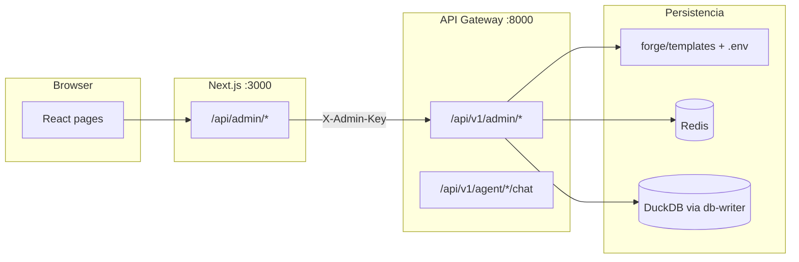

# Arquitectura — DuckClaw Admin UI

## Vista general

La consola admin es un **frontend desacoplado** del núcleo Python. No escribe DuckDB directamente ni lee `.env` del monorepo desde el browser.

## Backend-for-Frontend (BFF)

| Capa | Archivo | Responsabilidad |
|------|---------|-----------------|
| Cliente | `src/services/adminService.ts` | `fetch('/api/admin/...')` + headers de sesión |
| BFF | `src/app/api/admin/[...path]/route.ts` | Proxy transparente al gateway |
| API | `services/api-gateway/routers/admin.py` | Lógica admin, validación, máscaras |

El BFF añade:

- `X-Admin-Key` desde `process.env` (nunca expuesta al cliente).
- `x-duckclaw-role` y `x-duckclaw-actor` desde `localStorage` (`duckclaw-admin-auth`).
- Bloqueo **403** si `role === viewer` y el método es PUT/PATCH/POST/DELETE.
- Bloqueo **403** en `/audit` si el rol no es `admin`.

## Autenticación (v1 — demo)

| Capa | Mecanismo |
|------|-----------|
| UI | `src/store/authStore.ts` + `src/config/adminUsers.ts` |
| BFF | Confía en headers `x-duckclaw-role` enviados por el cliente |
| Gateway | `X-Admin-Key` únicamente |

**Limitación conocida:** un usuario malicioso podría falsificar el rol en headers si llamara al BFF sin pasar por la UI. Esto es aceptable solo en desarrollo local. Producción requiere sesión firmada en servidor (JWT/cookie httpOnly) — ver spec.

## Matriz fuente de verdad

| Entidad | Lectura | Escritura | Validación |
|---------|---------|-----------|------------|
| `manifest.yaml`, prompts, `skills/` | Disco `forge/templates/<id>/` | `PUT …/files/{path}` | ADF validator (AXIS) |
| `.env` gateway | GET enmascarado | `PATCH /admin/env` + `.env.bak` | Allow-list prefijos |
| `agent_config` | DuckDB por vault | `PUT /admin/runtime/config` → cola db-writer | Allow-list claves |
| `authorized_users` | DuckDB | CRUD whitelist Telegram | Telegram Guard spec |
| Historial chat | Redis | Solo lectura | `chat_history` |
| LangSmith | API externa | Solo lectura (opt-in) | PII masking |

Badge recomendado en UI futura: **canónico (archivo)** vs **override (runtime)**.

## Contrato REST (gateway)

Prefijo: `/api/v1/admin`. Errores estilo RFC 7807: `{ "type", "title", "status", "detail" }`.

### Plantillas

| Método | Ruta | Descripción |
|--------|------|-------------|
| GET | `/templates` | Lista workers |
| GET | `/templates/{id}` | Árbol de archivos |
| PUT | `/templates/{id}/files/{path}` | Body `{ "content": "..." }` |
| POST | `/templates` | Clonar worker |
| DELETE | `/templates/{id}` | Deny-list: routers sistema |
| POST | `/templates/{id}/validate` | ADF + manifest |

### Entorno y runtime

| Método | Ruta | Descripción |
|--------|------|-------------|
| GET/PATCH | `/env` | Claves permitidas (enmascaradas en GET) |
| GET | `/runtime/vaults` | Bóvedas conocidas |
| GET/PUT | `/runtime/config` | `agent_config` por vault + `chat_id` |

### Telegram y observabilidad

| Método | Ruta | Descripción |
|--------|------|-------------|
| GET | `/telegram/routes` | Parseo `DUCKCLAW_TELEGRAM_WEBHOOK_ROUTES` |
| GET/POST/DELETE | `/telegram/whitelist` | Usuarios autorizados |
| GET | `/chats/history` | Historial Redis |
| GET | `/traces/langsmith` | Opcional si `LANGCHAIN_API_KEY` |
| GET | `/health` | Gateway + workers + Redis |

Detalle completo: [spec DUCKCLAW_ADMIN_UI.md](../../../specs/features/platform/DUCKCLAW_ADMIN_UI.md).

## Workers protegidos

No se pueden eliminar: `entry_router`, `manager_router` y los IDs en deny-list del router admin.

## Tailscale y red

Si el gateway tiene `DUCKCLAW_TAILSCALE_AUTH_KEY`, las rutas `/api/v1/admin/*` suelen estar **exentas** de la cabecera Tailscale; la autenticación admin es solo `X-Admin-Key`. Para desarrollo local usa `http://127.0.0.1:8000`, no la IP Tailscale, salvo que configures ambos lados igual.
