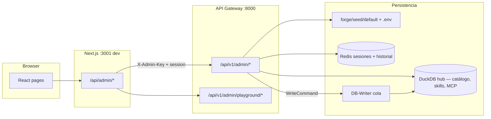

# Arquitectura — DuckClaw Admin UI

## Vista general

La consola admin es un **frontend desacoplado** del núcleo Python. No escribe DuckDB directamente ni lee `.env` del monorepo desde el browser.

```mermaid
flowchart LR
  subgraph browser [Browser]
    UI[React pages]
  end
  subgraph next [Next.js :3001 dev]
    BFF["/api/admin/*"]
  end
  subgraph gateway [API Gateway :8000]
    ADM["/api/v1/admin/*"]
    PG["/api/v1/admin/playground/*"]
  end
  subgraph data [Persistencia]
    DUCK[(DuckDB hub — catálogo, skills, MCP)]
    DISK["forge/seed/default + .env"]
    REDIS[(Redis sesiones + historial)]
    WRITER[DB-Writer cola]
  end
  UI --> BFF
  BFF -->|"X-Admin-Key + session"| ADM
  BFF --> PG
  ADM --> DUCK
  ADM --> DISK
  ADM --> REDIS
  ADM -->|"WriteCommand"| WRITER
  WRITER --> DUCK
```

## Backend-for-Frontend (BFF)

| Capa | Archivo | Responsabilidad |
|------|---------|-----------------|
| Cliente | `src/services/adminService.ts` | `fetch('/api/admin/...')` + CSRF + cookies |
| BFF | `src/app/api/admin/[...path]/route.ts` | Proxy al gateway; auth server-side |
| Proxies | `src/app/api/admin/playground/**` | Chat SSE, voz, Pipecat (timeouts largos) |
| API | `services/api-gateway/routers/admin.py` | Monta `admin_domains/*` |

El BFF añade:

- `X-Admin-Key` desde `process.env` (nunca expuesta al cliente).
- Rol y actor derivados de sesión (`/api/admin/auth/me` → gateway), no headers del cliente.
- Validación **CSRF** (`X-CSRF-Token`) en mutaciones.
- Bloqueo **403** si rol `user` y método de escritura no permitido.
- Bloqueo **403** en `/audit` y rutas `adminOnly` si el rol no es `admin`.

Navegación de pantallas: `src/config/adminNav.ts` (grupos Trabajo · Estudio · Plataforma).

## Autenticación

Ver spec canónica: [`specs/features/platform/ADMIN_CONSOLE_AUTH.md`](../../../specs/features/platform/ADMIN_CONSOLE_AUTH.md).

| Capa | Mecanismo |
|------|-----------|
| UI | `authStore.ts` + `AuthProvider` (hydrate `/auth/me`) |
| BFF | Cookies `session` + `csrf_token`; proxy auth; RBAC server-side |
| Gateway | Argon2id/PBKDF2, usuarios en hub DuckDB, Redis sessions, rate-limit login |

Sesión: cookie HttpOnly `session` + Redis `sess:{id}`. Sin credenciales en `localStorage`.

## Matriz fuente de verdad

| Entidad | Lectura | Escritura | Notas |
|---------|---------|-----------|--------|
| **Agentes** (workers) | DuckDB `admin_worker_catalog` + `admin_worker_versions` | Comandos tipados vía gateway → db-writer | Snapshot `manifest_snapshot` + `files_snapshot`; runtime usa `catalog_worker.load_manifest_from_catalog` |
| **Categorías skills (picker)** | DuckDB `admin_skill_categories`, `admin_skill_catalog_items` | Seed framework M028+; sync M029 | API `GET /catalog/skill-categories` |
| **Skills custom** | `admin_skills`, `admin_worker_skills` | CRUD admin + sync parcial al guardar manifest | Solo skills que existen en catálogo global |
| **MCP conectores** | `admin_mcp_connectors`, grants | Pantalla `/mcp` | Distinto de GitHub MCP empaquetado (`duckclaw.github.mcp_bridge`) |
| Plantilla `default` (filesystem) | `forge/seed/default/` | Solo despliegues legacy / seed | Otros worker IDs **no** cargan desde disco |
| `.env` gateway | GET enmascarado | `PATCH /admin/env` + `.env.bak` | Allow-list prefijos |
| `agent_config` | DuckDB por vault | `PUT /admin/runtime/config` → cola | Allow-list claves |
| `authorized_users` | DuckDB | CRUD whitelist Telegram | Telegram Guard spec |
| Historial chat | Redis / vault | Solo lectura en admin | Playground, Telegram |
| LangSmith | API externa | Solo lectura (opt-in) | PII masking |

### Herramientas en el manifest (UI)

En `/templates/[workerId]`:

| Pieza | Rol |
|-------|-----|
| `WorkerToolsDropdown.tsx` | Checkboxes por categoría (web, reportes, MCP, …) |
| `manifestSkillsEdit.ts` | Serializa `skills:` en YAML con configs por defecto |
| `useSkillCategoriesCatalog.ts` | Catálogo desde gateway (fallback local si 503) |
| `WorkerCapabilitiesCard.tsx` | Gaps runtime (Docker, Tavily, tools registradas) |

Activar una skill en el picker **no** basta: hay que **Guardar** el manifest. El runtime del gateway lee el snapshot en DuckDB, no el estado React en memoria.

**GitHub MCP** (skill `github` en manifest): requiere `GITHUB_TOKEN`, `docker` en PATH del proceso PM2, usuario en grupo `docker`, imagen `ghcr.io/github/github-mcp-server`. Ver troubleshooting en [`../README.md`](../README.md).

## Contrato REST (gateway)

Prefijo: `/api/v1/admin`. Errores estilo RFC 7807: `{ "type", "title", "status", "detail" }`.

### Agentes / plantillas

| Método | Ruta | Descripción |
|--------|------|-------------|
| GET | `/templates` | Lista workers visibles (catálogo DB + `default`) |
| GET | `/templates/{id}` | Árbol de archivos (snapshot) |
| PUT | `/templates/{id}/files/{path}` | Body `{ "content": "..." }` → cola writer |
| POST | `/templates` | Clonar / crear worker en catálogo |
| DELETE | `/templates/{id}` | Deny-list: routers sistema |
| POST | `/templates/{id}/validate` | ADF + manifest |
| GET | `/workers/{id}/capabilities` | Skills declaradas vs tools en runtime |

### Catálogo plataforma

| Método | Ruta | Descripción |
|--------|------|-------------|
| GET | `/catalog/skill-categories` | Categorías + baseline profiles para picker |
| GET/POST | `/skills` | Skills custom globales |

### Playground

| Método | Ruta | Descripción |
|--------|------|-------------|
| GET | `/playground/config` | Workers, vault, LLM, proyectos |
| POST | `/playground/chat` | Chat admin (manager + delegación) |
| POST | `/playground/voice` | STT → agente → TTS |

### Entorno y runtime

| Método | Ruta | Descripción |
|--------|------|-------------|
| GET/PATCH | `/env` | Claves permitidas (enmascaradas en GET) |
| GET | `/runtime/vaults` | Bóvedas conocidas |
| GET/PUT | `/runtime/config` | `agent_config` por vault + `chat_id` |

### Telegram, MCP, observabilidad

| Método | Ruta | Descripción |
|--------|------|-------------|
| GET | `/telegram/routes` | Parseo `DUCKCLAW_TELEGRAM_WEBHOOK_ROUTES` |
| GET/POST/DELETE | `/telegram/whitelist` | Usuarios autorizados |
| GET/POST | `/mcp/connectors` | Conectores MCP DB-first |
| GET | `/chats/history` | Historial Redis (debug) |
| GET | `/health` | Gateway + workers + Redis |

**Retirado:** `/api/v1/admin/train/*` y pestaña `/train` — usar `uv run duckops train`.

Detalle completo: [spec DUCKCLAW_ADMIN_UI.md](../../../specs/features/platform/DUCKCLAW_ADMIN_UI.md).

## Workers protegidos

No se pueden eliminar: `entry_router`, `manager_router` y los IDs en deny-list del router admin.

## Tailscale y red

Si el gateway tiene `DUCKCLAW_TAILSCALE_AUTH_KEY`, las rutas `/api/v1/admin/*` suelen estar **exentas** de la cabecera Tailscale; la autenticación admin es sesión + `X-Admin-Key` en el BFF. Para desarrollo local usa `http://127.0.0.1:8000` en `.env.local`. Admin en tailnet: [environment.md](environment.md#admin-en-el-celular-tailscale-serve).
