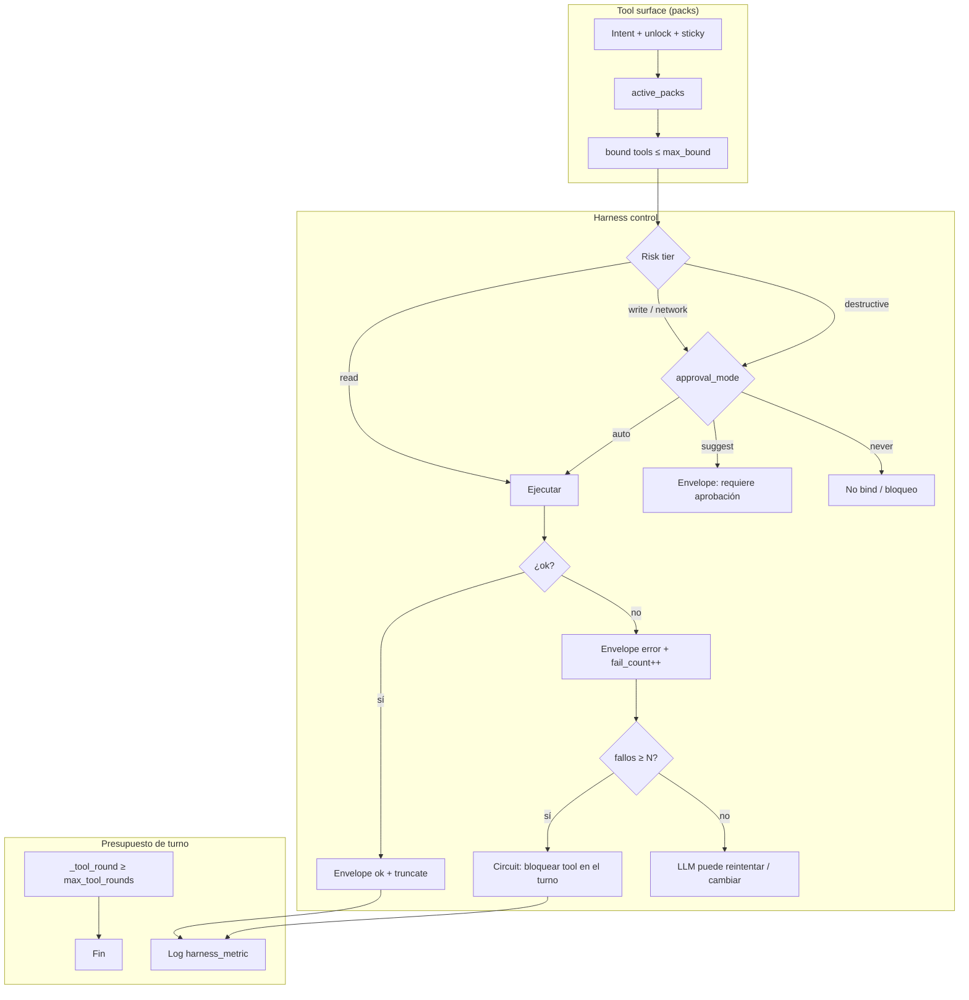
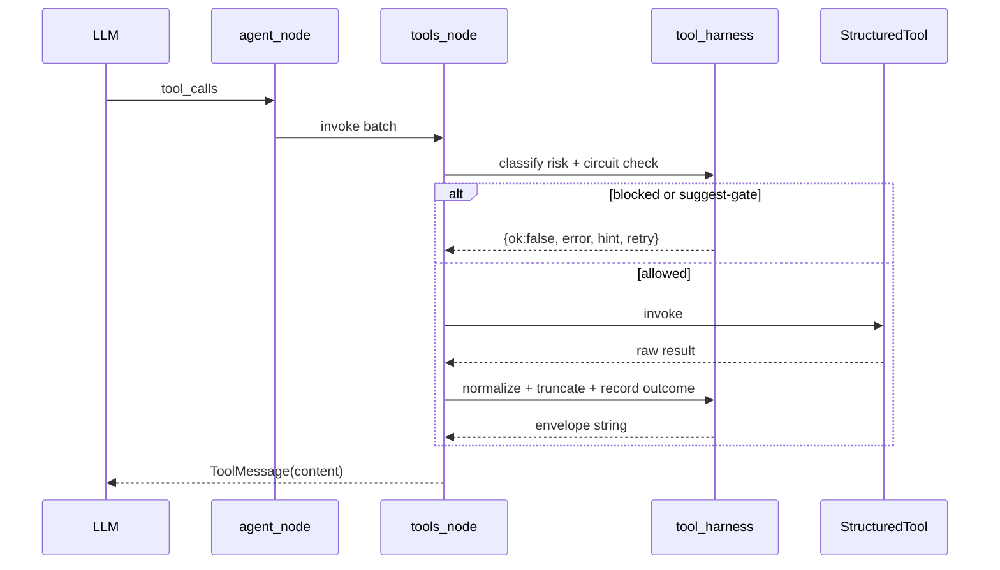
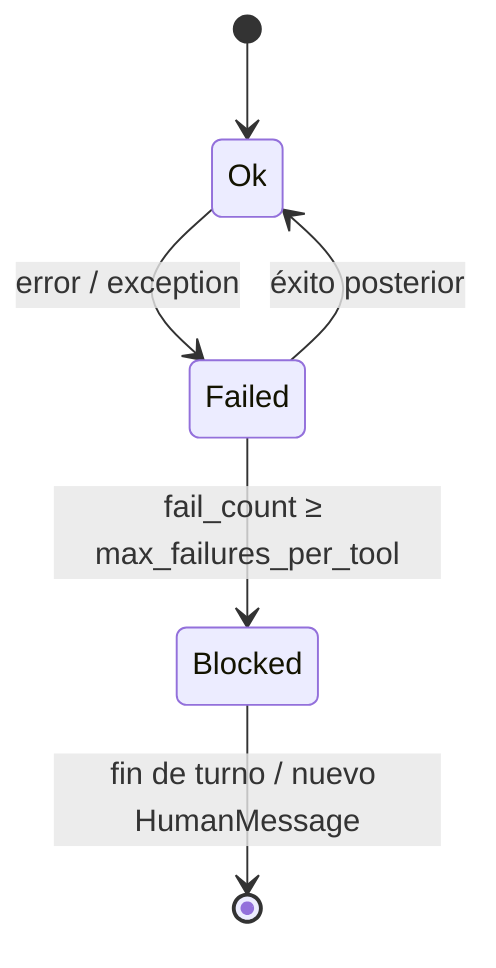

# Agent harness control (Claude × Codex)

Contrato de **control de ejecución** del worker: riesgo, envelopes, cortafuegos y
presupuesto de turno. Complementa [`AGENT_TOOL_SURFACE.md`](./AGENT_TOOL_SURFACE.md)
(qué tools se ven) con **qué se puede ejecutar y a qué costo**.

## Fuentes de consulta

| Fuente | Qué tomamos |
|--------|-------------|
| [Anthropic — Tool use / Tool Search (`defer_loading`)](https://platform.claude.com/docs/en/agents-and-tools/tool-use/tool-search-tool) | Surface pequeño always-on; dominio bajo demanda (ya: runtime packs) |
| [Anthropic — Tool use best practices](https://platform.claude.com/docs/en/agents-and-tools/tool-use/overview) | Descriptions claras; errores accionables; límites de repetición |
| [OpenAI — Function calling](https://platform.openai.com/docs/guides/function-calling) | Menos de ~20 tools al inicio; schemas estrictos |
| OpenAI Codex / agent harness (approval modes, apply→verify) | `auto` / `suggest` / `never` para mutaciones; verificar tras actuar |
| DuckClaw HITL existente (`packages/agents/.../hitl/`) | Fase 2: encolar `PENDING_HITL` real; fase 1: gate in-graph + envelope |

## Idea (menos técnica)

- **Claude**: no mostrar todas las tools a la vez.  
- **Codex**: no dejar que el agente toque lo peligroso sin freno, ni gaste el turno entero reintentando fallos.  
- **DuckClaw**: packs (visión) + harness (freno y presupuesto).

## Arquitectura pensada



### Flujo de una tool call



### Risk tiers

| Tier | Significado | Default policy (`suggest`) |
|------|-------------|----------------------------|
| `read` | Solo lectura (SQL select, RAG, disco) | auto |
| `write` | Mutación reversible / scoped (patch report, OUTPUT) | auto (HITL opcional por bridge) |
| `network` | Sale a red (MCP remoto, web search) | auto si pack activo |
| `destructive` | Irreversible o privilegiado (delete, push, sandbox write amplio) | **no ejecuta**: envelope `retry:false` + hint de unlock/approve |

Clasificación: heurística por nombre/prefijo en `tool_harness.py` (extensible vía manifest después).

### Envelope canónico

```json
{"ok": true|false, "error"?: string, "hint"?: string, "retry"?: boolean, "code"?: string}
```

Éxitos pueden ser `{ok:true, ...datos}` o payloads legacy; el harness **normaliza fallos** (excepciones y `ok:false`) y trunca contenido largo.

### Circuit breaker (por tool, por turno)



Estado en LangGraph: `_tool_fail_counts`, `_harness_blocked_tools`.

### Presupuesto

| Control | Default | Dónde |
|---------|---------|-------|
| `max_tool_rounds` | 10 | ya existía (`should_continue`) |
| `max_failures_per_tool` | 2 | nuevo (`tool_harness` + `tools_node`) |
| `max_tool_result_chars` | 12000 | truncate de ToolMessage hacia el LLM |
| `max_bound_tools` | 16 | surface (packs) |

### Override por worker

```yaml
tool_surface:
  harness:
    approval_mode: suggest   # auto | suggest | never
    max_failures_per_tool: 2
    max_tool_result_chars: 12000
```

## Implementación (fase 1 — este cambio)

| Pieza | Path |
|-------|------|
| Policy pura | `workers/tool_harness.py` |
| Wire ejecución | `workers/factory_graph_nodes_tools.py` |
| Config | `tool_surface.harness` vía helpers en `tool_harness` |
| Tests | `tests/test_tool_harness.py` |
| Surface doc | actualizar gaps en `AGENT_TOOL_SURFACE.md` |

## Fase 2 (explícitamente fuera de este PR)

- Encolar destructive en `PENDING_HITL` + `/approve` fly/admin (reutilizar `hitl/`).
- Verify-loop post-sandbox (lint/test).
- Eval golden de selección de packs/tools en CI.
- Admin Overview: `harness_metric` + `runtime_tool_packs_metric`.

## Métrica

Log estructurado:

`harness_metric {blocked, failures, approval_mode, truncated_results, risk_denied}`
