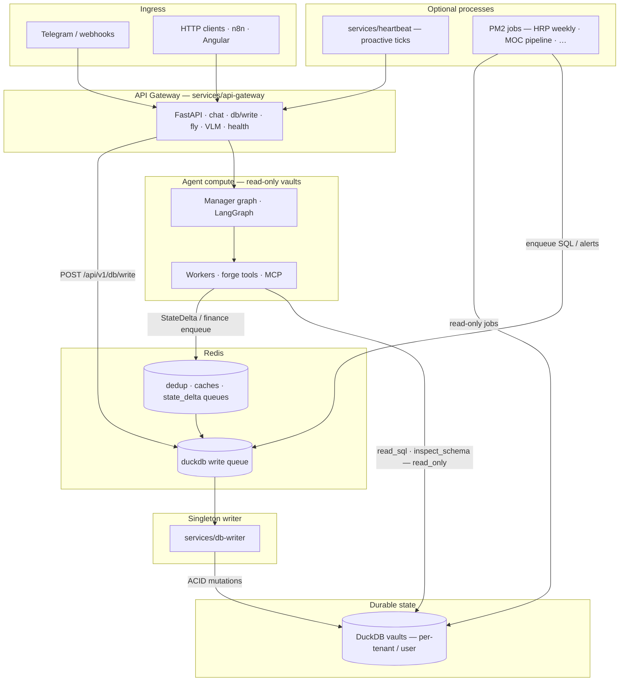

# System overview

High-level view of how **ingress**, **agent compute**, **queues**, and **durable state** fit together. Canonical narrative and ASCII detail remain in the repository under **`specs/core/`** (for example `specs/core/00_Flujo de Vida del Dato (Wizard).md` and `specs/core/01_System_Infrastructure.md`). See the [Specs index](../specs/index.md) for how published docs relate to those paths.

## Architecture diagram (Mermaid)

## Invariants (short)

| Concern | Rule |
|--------|------|
| Who writes DuckDB? | **Only** `services/db-writer` (singleton path). Gateway and workers use **read-only** opens for vault paths in normal operation. |
| How do agents persist? | Enqueues to Redis; DB-Writer applies in a transaction. |
| Where is truth? | Product/architecture detail: **`specs/`**; this page is an overview for MkDocs readers. |

## Related docs

- [Singleton Writer](singleton_writer.md) — queue contract and mutation path.
- [Tri-Cameral Memory](tri_cameral_memory.md) — SQL / PGQ / VSS roles.
- [Strix Sandbox](strix_sandbox.md) — isolated execution boundary.
- [Specs index](../specs/index.md) — curated links into `specs/`.
