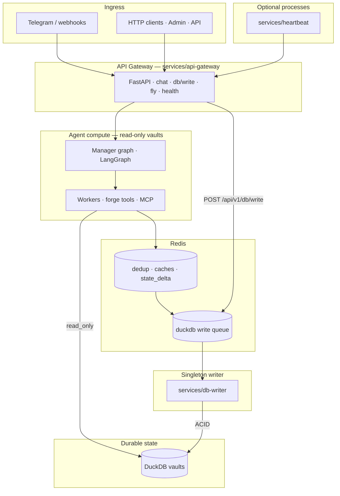

# System overview

Ingress → API Gateway → agent compute (read-only) → Redis queues → singleton DB-Writer → DuckDB vaults.

## Architecture diagram (Mermaid)

```mermaid
flowchart TB
  subgraph Ingress["Ingress"]
    TG[Telegram / webhooks]
    HTTP[HTTP clients · Admin · API]
  end

  subgraph Gateway["API Gateway — services/api-gateway"]
    API[FastAPI · chat · db/write · fly · health]
  end

  subgraph Compute["Agent compute — read-only vaults"]
    MGR[Manager graph · LangGraph]
    WRK[Workers · forge tools · MCP]
  end

  subgraph Sidecars["Optional processes"]
    HB[services/heartbeat]
  end

  subgraph Async["Redis"]
    QW[(duckdb write queue)]
    DD[(dedup · caches · state_delta)]
  end

  subgraph Writer["Singleton writer"]
    DW[services/db-writer]
  end

  subgraph Data["Durable state"]
    VAULT[(DuckDB vaults)]
  end

  TG --> API
  HTTP --> API
  HB --> API

  API --> MGR
  MGR --> WRK
  WRK -->|"read_only"| VAULT

  API -->|"POST /api/v1/db/write"| QW
  WRK --> DD
  DD --> QW

  QW --> DW
  DW -->|"ACID"| VAULT
```

## Invariants

| Concern | Rule |
|--------|------|
| Who writes DuckDB? | Only `services/db-writer`. Gateway/workers: `read_only=True`. |
| How do agents persist? | Typed commands → Redis → DB-Writer transaction. |
| Hub canónico | `db/private/default/duckclaw.duckdb` |

## Related

- [Singleton Writer](singleton_writer.md)
- [Gateway ↔ DB-Writer](GATEWAY_DB_WRITER_BOUNDARIES.md)
- [Process boundaries](GATEWAY_PROCESS_BOUNDARIES.md)
- [DB-Writer contract](../api/DB_WRITER_CONTRACT.md)
- [Tri-Cameral Memory](tri_cameral_memory.md)
- [Docs index](../README.md)
