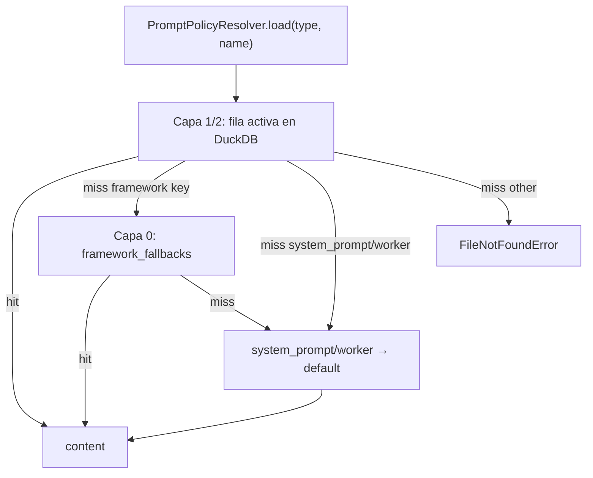

# Framework Policy Pack (P0)

## Objetivo

Garantizar que DuckClaw **nunca falle en el primer mensaje** por policies de framework faltantes, sin romper el modelo **DB-first**. El pack versionado alimenta la semilla en DuckDB; el runtime lee la DB primero y solo usa código como airbag mínimo.

## Modelo de 3 capas

| Capa | Fuente | Alcance | Cuándo aplica |
|------|--------|---------|---------------|
| **0 — Airbag** | `framework_fallbacks.py` + `framework_policy_pack_v1.json` | Solo las 3 keys de `FRAMEWORK_PROMPT_POLICY_REQUIREMENTS` | Fila activa ausente en `main.prompt_policy_registry` |
| **1 — Semilla** | Migración 021 (`apply_framework_policy_pack`) | Airbag + directivas opcionales del pack (p. ej. `directive/report_engine`) | Tras `duckclaw-migrate` / `run_pending_migrations` |
| **2 — Usuario** | Admin API / consola | Cualquier policy en registry | Edición, versionado, `active=false` sin borrar |

**Workers y dominio** (`system_prompt/<worker_id>`, `directive/*`, `manager_task/*` custom) siguen **DB-first estricto**: sin fallback silencioso en código salvo la regla de herencia documentada abajo.

## Keys de framework (capa 0 y pack)

| `policy_type` | `policy_name` | Uso runtime |
|---------------|---------------|-------------|
| `capability` | `generic_worker` | Respuesta rápida “¿qué puedes hacer?” con `{worker_id}`, `{tenant_id}` |
| `capability` | `default_fallback` | Sin worker identificado |
| `system_prompt` | `default` | Plantilla madre de identidad y reglas del agente genérico |

**Directivas opcionales** (siembra del pack, no airbag): `directive/report_engine` — se anexa al system prompt en runtime cuando aplica.

Placeholders en JSON/pack: `{tenant_id}`, `{worker_id}` — **no** usar `{{}}`.

## Herencia `system_prompt/<worker_id>`

| Situación | Resolver | Health admin |
|-----------|----------|--------------|
| Fila `system_prompt/<worker_id>` activa en DB | Usa esa fila | OK |
| Sin fila, worker en catálogo (futuro P0.11 sync) | Hereda `system_prompt/default` (capas 1→0) | **Warning** “especialización pendiente” |
| Worker `default` | `system_prompt/default` | OK si framework presente |

El health API sigue listando workers sin fila propia como **missing** para visibilidad operativa; el runtime no devuelve HTTP 500.

## Esquema del pack JSON

Archivo canónico: `packages/shared/src/duckclaw/seeds/framework_policy_pack_v1.json`

```json
{
  "pack_version": "framework_policy_pack_v1",
  "metadata": {
    "seed": "framework_policy_pack_v1",
    "scope": "framework",
    "editable": true,
    "locale": "es"
  },
  "policies": [
    {
      "policy_type": "capability | system_prompt",
      "policy_name": "string",
      "content": "texto con placeholders"
    }
  ]
}
```

- **Airbag:** 3 policies obligatorias + directivas opcionales en el mismo JSON.
- `content` incluye secciones inspiradas en SOUL / AGENTS / TOOLS / RULES (OpenClaw/Hermes/ECC) fusionadas en `system_prompt/default`.
- Capability policies: texto corto (3–8 líneas), no duplicar el system prompt completo.

## Flujo del resolver



Log operativo: `degraded_framework_policy` (capa 0), `inherited_system_prompt` (herencia worker).

## Migración 021

- Hook Python en `schema_migrations` tras DDL no-op.
- `apply_framework_policy_pack(con)` en `duckclaw.framework_policy_pack`:
  - Idempotente por checksum + metadata `seed`.
  - Si el contenido del pack cambió: nueva versión, desactiva la anterior.
  - No borra policies de workers ni `manager_task` custom.

## Restore-framework (futuro P0 admin)

`POST /prompt-policies/restore-framework` re-invoca `apply_framework_policy_pack(db, force=True)` para volver al pack del repo sin tocar `system_prompt/<worker>`.

## Catálogo de skills — visión (no implementado en P0)

**Objetivo producto:** vista admin tipo “instalar skills” donde el operador elige qué skills del catálogo Forge activar por worker/proyecto — equivalente DB-first al disco de skills de OpenClaw/Hermes, pero con auditoría y grants.

| Hoy | Futuro |
|-----|--------|
| Skills en manifest YAML + `admin_worker_skills` | UI: checklist por worker, preview de tools expuestas |
| Import plantilla no upserta `system_prompt/<id>` automáticamente | P0.11: sync `soul.md` + `system_prompt.md` → registry |
| Learning loop (P2) propone candidatos | Vista “Skills sugeridos” con aprobar/rechazar |

No construir la UI completa en P0 salvo que sea trivial; documentar aquí para alinear P2/P3.

## Tests de contrato

- Pack JSON y `FRAMEWORK_PROMPT_POLICY_REQUIREMENTS` mismas keys.
- Resolver: DB vacía (sin migrate) → capa 0 para `capability/generic_worker`.
- Tras migrate 021 → contenido robusto (`## IDENTITY` en `system_prompt/default`).
- Worker sin fila → hereda default, no 500.

## Referencias

- [`DB_FIRST_CORE_REFACTOR.md`](DB_FIRST_CORE_REFACTOR.md) — excepción capa 0
- [`PLUG_AND_PLAY_ONBOARDING.md`](PLUG_AND_PLAY_ONBOARDING.md) — día 0
- `packages/agents/src/duckclaw/prompt_policies/resolver.py`
- `packages/shared/src/duckclaw/framework_policy_pack.py`
