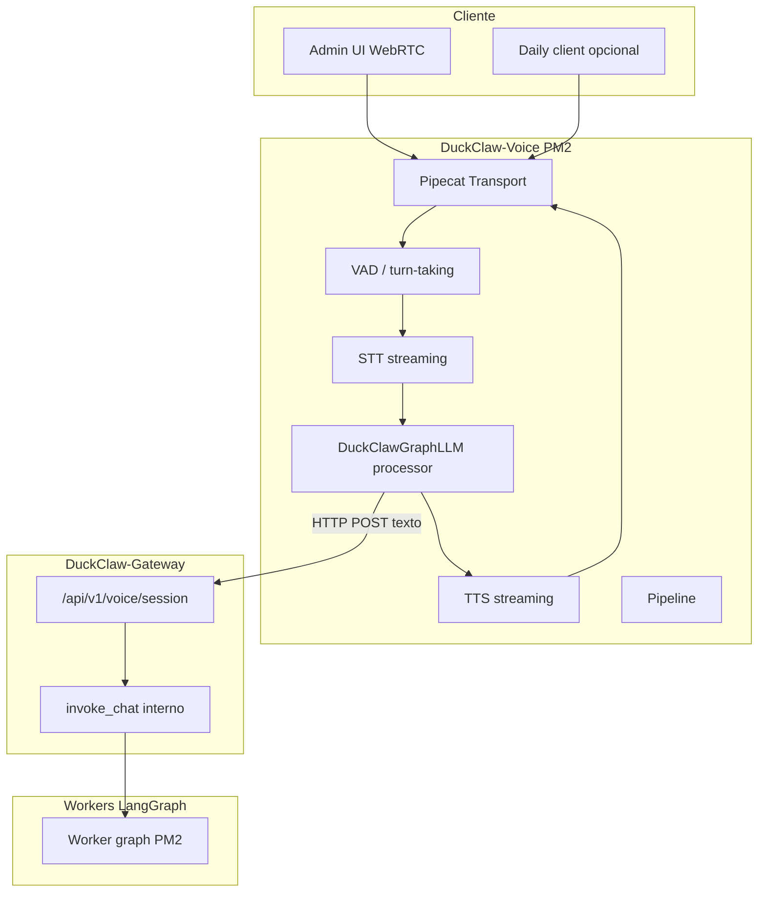

# Pipecat Voice Realtime — spec v1

# IoTCoreLabs / DuckClaw core
# Fecha: 2026-06-27
# Versión: 1.0

Entrada general: [`docs/README.md`](../../../README.md). Operación: [`docs/COMANDOS.md`](../../../COMANDOS.md).

**Relacionado:** voz batch existente (`/admin/playground/voice`, Sensory Node), [`TELEGRAM.md`](../telegram-gateway/TELEGRAM.md), [`DB_FIRST_CORE_REFACTOR.md`](DB_FIRST_CORE_REFACTOR.md).

---

## Objetivo

Añadir **conversación de voz en tiempo real** (WebRTC / WebSocket, barge-in, turn-taking) como **servicio genérico de DuckClaw**, usando [Pipecat](https://docs.pipecat.ai/) como capa de transporte y audio, **sin reimplementar** LangGraph, tools ni guardrails de dominio.

**Principio de soberanía:** el cerebro sigue siendo `invoke_chat` → worker LangGraph. Pipecat **no** llama al LLM directo con API keys del usuario salvo en modo dev explícito.

**Principio DB-first:** cero ramas `if worker_id == "<nombre-vertical>"` en el core. El `worker_id`, `tenant_id` y `session_id` llegan por configuración de sesión; workers de dominio se activan vía catálogo importado, no código especial en `integrations/pipecat/`.

**Catálogo externo (posterior):** templates importados desde repos de workers heredan voz igual que cualquier entrada del catálogo — sin fork del pipeline Pipecat.

---

## Qué NO es esta spec

| Item | Decisión |
|------|----------|
| Reemplazar Sensory Node | **No** — Sensory sigue para Telegram voice notes y `/playground/voice` batch |
| Reemplazar LangGraph | **No** |
| LangSmith Engine | Fuera de alcance (ver spec Observability self-hosted aparte) |
| Lógica de dominio / APIs externas en Pipecat | **Prohibido** — solo HTTP al gateway |

---

## Estado actual (baseline)

| Componente | Ruta | Modo |
|------------|------|------|
| STT/TTS batch | `integrations/sensory-node/` | Mac mini, Tailscale |
| Playground voz | `services/api-gateway/routers/admin_domains/playground/chat_routes.py` | STT → `invoke_chat` → TTS |
| Cliente sensory | `services/api-gateway/core/sensory_client.py` | HTTP |
| Grafo workers | `packages/agents/src/duckclaw/workers/` | LangGraph |
| Pipecat | — | **No existe aún** |

---

## Arquitectura



### Flujo cognitivo (un turno de voz)

1. Usuario habla → transport recibe audio.
2. VAD detecta fin de turno → STT streaming produce texto.
3. **`DuckClawGraphLLM`** envía texto al gateway (mismo contrato que playground chat, `stream=false` en v1).
4. Gateway ejecuta `invoke_chat` con `worker_id`, `tenant_id`, `chat_id`/`session_id` de la sesión Pipecat.
5. Respuesta texto → TTS streaming → audio al cliente.
6. Trazas: `conversation_traces` + (futuro) `observability_runs` — mismos hooks que texto.

---

## Esquema de datos

**No requiere tablas nuevas en v1.** Estado de sesión en memoria del proceso Pipecat + Redis opcional para multi-instancia.

Tabla opcional v2 (auditoría voz):

```sql
-- duckclaw gateway DB — opcional v2
CREATE TABLE IF NOT EXISTS main.voice_sessions (
    session_id VARCHAR PRIMARY KEY,
    worker_id VARCHAR NOT NULL,
    tenant_id VARCHAR NOT NULL,
    transport VARCHAR NOT NULL,  -- small_webrtc | daily | websocket
    status VARCHAR NOT NULL DEFAULT 'active',
    started_at TIMESTAMP DEFAULT CURRENT_TIMESTAMP,
    ended_at TIMESTAMP,
    turn_count INTEGER DEFAULT 0,
    metadata JSON
);
```

Persistencia v1: logs estructurados + `conversation_traces` (user/assistant ya en JSONL).

---

## Variables de entorno

Agregar a `.env.example`:

```bash
# ── Pipecat Voice Realtime (opcional) ───────────────────────────────────────
DUCKCLAW_VOICE_ENABLED=false
DUCKCLAW_VOICE_BIND_HOST=127.0.0.1          # dev local; Tailscale IP en prod Mac mini
DUCKCLAW_VOICE_PORT=8012
DUCKCLAW_VOICE_TRANSPORT=small_webrtc       # small_webrtc | daily | fastapi_websocket

# Gateway al que delega el LLM (grafo) — NO el LLM directo
DUCKCLAW_VOICE_GATEWAY_URL=http://127.0.0.1:8000
DUCKCLAW_VOICE_GATEWAY_ADMIN_KEY=           # mismo secreto que admin console

# Worker por defecto si el cliente no especifica
DUCKCLAW_VOICE_DEFAULT_WORKER=default
DUCKCLAW_VOICE_DEFAULT_TENANT=default

# STT/TTS (Pipecat extras — ver pyproject)
# Dev: deepgram + cartesia | Prod: adapter Sensory opcional
DUCKCLAW_VOICE_STT_PROVIDER=deepgram        # deepgram | openai | sensory_adapter
DUCKCLAW_VOICE_TTS_PROVIDER=cartesia        # cartesia | elevenlabs | sensory_adapter
DEEPGRAM_API_KEY=
CARTESIA_API_KEY=

# Daily (solo si DUCKCLAW_VOICE_TRANSPORT=daily)
DAILY_API_KEY=
DAILY_ROOM_URL=

# Timeouts — workers lentos (tools, SQL) necesitan UX especial
DUCKCLAW_VOICE_GRAPH_TIMEOUT_SEC=120
DUCKCLAW_VOICE_PROGRESS_PHRASE=Un momento, estoy consultando datos.

# Coexistencia con Sensory batch (no reemplazar)
DUCKCLAW_SENSORY_BASE_URL=                  # sigue igual para Telegram/playground batch
```

---

## Layout de archivos (DuckClaw repo)

```
integrations/pipecat-voice/
├── pyproject.toml              # pipecat-ai[webrtc,deepgram,cartesia,silero] + pipecat-ai-small-webrtc-prebuilt
├── duckclaw_pipecat/
│   ├── __init__.py
│   ├── main.py                 # entry: uvicorn / pipecat runner
│   ├── config.py               # env, validación
│   ├── pipeline_factory.py     # arma Pipeline según transport
│   ├── processors/
│   │   ├── duckclaw_graph_llm.py   # ★ bridge HTTP → gateway
│   │   ├── progress_tts.py         # "consultando..." mientras grafo tarda
│   │   └── sensory_stt_adapter.py  # opcional: STT batch vía sensory (v1.1)
│   ├── transports/
│   │   ├── small_webrtc.py
│   │   ├── daily.py
│   │   └── websocket.py
│   └── session_context.py      # worker_id, tenant_id, chat_id por sesión
├── scripts/
│   └── start_voice.sh          # PM2 launcher (patrón sensory-node)
└── tests/
    ├── test_duckclaw_graph_llm.py
    └── test_session_context.py

config/ecosystem.voice.config.cjs   # PM2 DuckClaw-Voice

services/api-gateway/
├── routers/voice_realtime.py       # token/session bootstrap (opcional v1)
└── core/voice_session.py           # emite credenciales Daily / room id

apps/duckclaw-admin/
└── (fase 2) botón "Llamada en vivo" → URL transport
```

**Regla:** todo lo anterior vive en **DuckClaw**. Repos de workers externos no añaden código Pipecat en v1.

---

## Contrato — `DuckClawGraphLLM` processor

### Responsabilidad

Convertir **texto STT** en **texto assistant** llamando al gateway existente. Equivalente a `playground_voice` sin paso STT/TTS batch (ya los hace Pipecat).

### HTTP (v1 — reutilizar admin playground)

```http
POST /api/v1/admin/playground/chat
Authorization: Bearer ${DUCKCLAW_VOICE_GATEWAY_ADMIN_KEY}
X-DuckClaw-Actor: voice-pipecat
Content-Type: application/json

{
  "worker_id": "default",
  "chat_id": "voice-<uuid>",
  "message": "<transcripción STT>",
  "stream": false,
  "voice_response": false
}
```

Respuesta: `{ "response": "...", "worker_id": "..." }` — mismo shape que `format_playground_chat_payload`.

### HTTP (v1.1 — endpoint dedicado, recomendado antes de prod)

```http
POST /api/v1/voice/turn
Authorization: Bearer ${DUCKCLAW_VOICE_SERVICE_KEY}

{
  "worker_id": "default",
  "tenant_id": "default",
  "session_id": "voice-abc",
  "transcript": "...",
  "delivery_context": "trusted_voice_service"
}
```

Implementación: thin wrapper sobre `invoke_chat` con `GatewayDeliveryContext.trusted_voice_service()` (nuevo enum value o reutilizar `trusted_admin_console` con audit tag).

### Pseudocódigo processor

```python
class DuckClawGraphLLM(FrameProcessor):
    """
    Pipecat LLM slot reemplazado por delegación al grafo DuckClaw.
    Econofísica: la voz es canal; el grafo es ley — no acoplar tools aquí.
    """

    async def process_frame(self, frame, direction):
        if isinstance(frame, TranscriptionFrame):
            reply = await self._invoke_graph(frame.text)
            await self.push_frame(TextFrame(reply))
        await self.push_frame(frame, direction)

    async def _invoke_graph(self, text: str) -> str:
        # httpx async POST → gateway
        # timeout DUCKCLAW_VOICE_GRAPH_TIMEOUT_SEC
        # on timeout: return DUCKCLAW_VOICE_PROGRESS_PHRASE + log warning
        ...
```

---

## Gateway — cambios mínimos

### ARCHIVO A CREAR (v1.1): `services/api-gateway/routers/voice_realtime.py`

- `POST /api/v1/voice/session` — crea `session_id`, devuelve transport params (Daily room URL + token, o WebRTC offer endpoint).
- `POST /api/v1/voice/turn` — turno texto→texto para Pipecat (sin audio).
- Auth: `DUCKCLAW_VOICE_SERVICE_KEY` (header) distinto de admin UI key.

### ARCHIVO A MODIFICAR (v1): ninguno obligatorio si se reutiliza `/admin/playground/chat`.

### Lifespan

No registrar Pipecat en el gateway FastAPI principal — **proceso PM2 separado** (`DuckClaw-Voice`), igual que `Sensory-Node`.

---

## PM2 — `config/ecosystem.voice.config.cjs`

```javascript
module.exports = {
  apps: [{
    name: "DuckClaw-Voice",
    script: "integrations/pipecat-voice/scripts/start_voice.sh",
    interpreter: "bash",
    cwd: path.resolve(__dirname, ".."),
    autorestart: true,
    max_restarts: 10,
  }],
};
```

Arranque:

```bash
pm2 start config/ecosystem.voice.config.cjs
pm2 logs DuckClaw-Voice
```

Mac mini: `DUCKCLAW_VOICE_BIND_HOST=<tailscale-ip>`. Gateway puede estar en Hetzner — el bridge HTTP va por Tailscale (`DUCKCLAW_VOICE_GATEWAY_URL=http://100.x.y.z:8000`).

---

## Coexistencia Sensory vs Pipecat

| Caso de uso | Canal | Implementación |
|-------------|-------|----------------|
| Telegram voice note | Batch | Sensory STT → `invoke_chat` → texto (TTS opcional) |
| Admin playground nota voz | Batch | `/admin/playground/voice` |
| Admin UI llamada en vivo | Realtime | Pipecat + WebRTC |
| Worker lento (tools, SQL) | Realtime con progreso | `progress_tts.py` + timeout largo |

**No unificar** Sensory y Pipecat en un solo proceso en v1.

---

## UX — workers con tools lentos

Workers con tools pesados pueden tardar 30–90 s por turno. Pipecat realtime **requiere**:

1. **`progress_tts`** — al superar 3 s sin respuesta, TTS: *"Un momento, estoy consultando datos."*
2. **`DUCKCLAW_VOICE_GRAPH_TIMEOUT_SEC`** ≥ 120 en workers con consultas o herramientas lentas.
3. **Modo voz en manifest (fase 2)** — `voice.realtime_hints: concise` en YAML del worker; **no** código en core.

---

## Fases de implementación

### Fase 0 — Scaffold (0.5 d)
- [x] `integrations/pipecat-voice/` + `pyproject.toml` con extras mínimos
- [x] `ecosystem.voice.config.cjs`
- [x] `.env.example` keys
- [x] Test unitario mock HTTP del bridge (13 tests en `integrations/pipecat-voice/tests/`)

### Fase 1 — MVP dev (1–2 d)
- [x] `SmallWebRTCTransport` + Deepgram STT + Cartesia TTS
- [x] `DuckClawGraphLLM` → `/admin/playground/chat`
- [ ] Smoke: browser local → worker `default` → respuesta hablada
- [x] Fallo gateway no tumba pipeline (try/except + log)

### Fase 2 — Gateway dedicado (1 d)
- [ ] `/api/v1/voice/turn` + `/api/v1/voice/session`
- [ ] `DUCKCLAW_VOICE_SERVICE_KEY`
- [ ] Audit log `voice-pipecat` actor

### Fase 3 — Admin UI (1–2 d)
- [x] Botón "Voz en vivo" en playground
- [x] Indicador transport conectado / latencia (`LiveVoiceBar` + RTVI subtítulos)
- [x] Docs en `apps/duckclaw-admin/docs/voice-realtime.md`
- [x] RTVI data channel: `app_state`, `update_state`, transcripciones

### Fase 4 — Daily prod (opcional)
- [ ] `DailyTransport` + room provisioning
- [ ] TLS / funnel documentado

### Fase 5 — Catálogo de workers (después)
- [ ] Re-import catálogo (`import_workers.sh`) — workers de dominio disponibles por `worker_id`
- [ ] Manifest flags opcionales en `templates/*/manifest.yaml`:

```yaml
voice:
  realtime_enabled: true
  progress_phrase_es: "Un momento, estoy consultando datos."
  max_turn_latency_sec: 180
```

- [ ] **Sin** código Pipecat en repos de workers — solo metadata consumida por gateway/playground al listar workers con voz.

---

## Validaciones

| ID | Regla |
|----|-------|
| V1 | Fallo STT/TTS/gateway **no** lanza excepción no capturada al usuario — audio de error genérico o silencio + log |
| V2 | `session_id` estable por llamada WebRTC — mismo hilo en `conversation_traces` |
| V3 | Pipecat **nunca** persiste API keys de LLM del worker en logs |
| V4 | `worker_id` inválido → 403 del gateway, mensaje TTS: "Worker no disponible" |
| V5 | Con `DUCKCLAW_VOICE_ENABLED=false`, PM2 no arranca DuckClaw-Voice (script exit 0 + log) |

---

## Edge cases

**EC1 — Gateway en VPS, voz en Mac mini:** latencia de red Tailscale añade RTT al grafo; medir p95 antes de Daily prod.

**EC2 — Respuesta markdown/tabla:** TTS debe pasar por `prepare_text_for_tts()` (reutilizar lógica de `sensory_client._strip_worker_header` / tablas → prosa corta).

**EC3 — Multi-tenant:** filtrar `tenant_id` en sesión; nunca mezclar `chat_id` entre tenants.

**EC4 — Barge-in durante tool loop:** v1 ignora barge-in mientras `_invoke_graph` in-flight; v2 cancel vía `abort_chat_invoke_task`.

**EC5 — Disco / trazas:** cada turno voz genera línea JSONL igual que texto; compaction igual que resto.

---

## Criterios de aceptación

- [ ] `DuckClaw-Voice` PM2 online en Mac mini con `SmallWebRTC`
- [ ] Conversación es↔en 3+ turnos con worker `default` sin crash
- [ ] Mismo `chat_id` aparece en `conversation_traces/YYYY/MM/DD/traces.jsonl`
- [ ] Sensory + `/playground/voice` siguen funcionando sin regresión
- [ ] Worker importado desde catálogo invocable por `worker_id` sin cambiar código Pipecat
- [ ] Documentación en este archivo + entrada en [`README.md`](README.md) del índice specs

---

## Tests

| Test | Ruta |
|------|------|
| Bridge HTTP mock | `integrations/pipecat-voice/tests/test_duckclaw_graph_llm.py` |
| Session context | `integrations/pipecat-voice/tests/test_session_context.py` |
| Gateway voice turn | `services/api-gateway/tests/test_voice_realtime_router.py` (fase 2) |
| E2E manual | `scripts/deployment/test_pipecat_voice_smoke.sh` |

---

## Dependencias Pipecat (verificado)

| Item | Correcto | Incorrecto (no usar) |
|------|----------|----------------------|
| Extras pip | `pipecat-ai[webrtc,deepgram,cartesia,silero]` | `pipecat-ai[smallwebrtc,...]` — extra inválido |
| UI WebRTC dev | `pipecat-ai-small-webrtc-prebuilt` | — |
| Transport | `pipecat.transports.smallwebrtc.*` | `pipecat.transports.network.*` |
| STT | `pipecat.services.deepgram.stt.DeepgramSTTService` | — |
| TTS | `pipecat.services.cartesia.tts.CartesiaTTSService` | — |

Instalar extras realtime:

```bash
cd integrations/pipecat-voice
uv sync --extra realtime --extra dev
uv run pytest tests -q
```

### Arranque local (smoke manual)

1. En `.env` del repo duckclaw: `DUCKCLAW_VOICE_ENABLED=true`, `DEEPGRAM_API_KEY`, `CARTESIA_API_KEY`, `DUCKCLAW_VOICE_GATEWAY_ADMIN_KEY` (mismo que admin console).
2. Gateway activo: `DuckClaw-Gateway` en `DUCKCLAW_VOICE_GATEWAY_URL`.
3. `pm2 start config/ecosystem.voice.config.cjs`
4. Abrir `http://127.0.0.1:8012/client/` (prebuilt Small WebRTC UI).

---

## Referencias

- Pipecat docs: https://docs.pipecat.ai/
- Sensory existente: `integrations/sensory-node/`
- Playground voice batch: `chat_routes.py` `/playground/voice`
- DB-first: [`DB_FIRST_CORE_REFACTOR.md`](DB_FIRST_CORE_REFACTOR.md)
