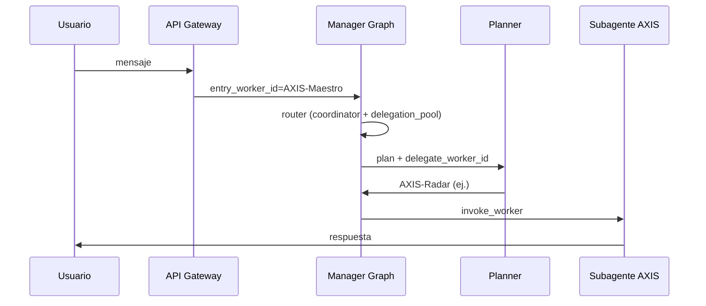

# AXIS — MAESTRO como coordinador ADF (orquestador)

## Objetivo

El bot Marco (y cualquier gateway con `entry_worker_id` coordinador) debe:

1. Entrar por el **Manager Graph** (planner).
2. Fijar **MAESTRO** (`AXIS-Maestro`) como coordinador ADF.
3. Delegar cada turno a **un** subagente AXIS según dominio (`AXIS-Coder`, `AXIS-Radar`, …).

## Estructura de carpetas (no anidar)

Los seis agentes AXIS siguen siendo **hermanos** bajo `forge/templates/`:

```
forge/templates/
├── AXIS-Maestro/     ← coordinador (orchestrator.enabled)
├── AXIS-Coder/
├── AXIS-Mirror/
├── AXIS-Radar/
├── AXIS-Sentinel/
└── AXIS-Phantom/
```

MAESTRO **no** copia ni contiene los otros ADF; los referencia en `manifest.yaml` → `orchestrator.orchestrates`.

## Contrato manifest (reutilizable por cualquier dev)

```yaml
id: AXIS-Maestro
agent_id: maestro

orchestrator:
  enabled: true
  orchestrates:
    - AXIS-Coder
    - AXIS-Mirror
    - AXIS-Radar
    - AXIS-Sentinel
    - AXIS-Phantom
```

- `agent_id`: alias lógico (`maestro`) para webhooks y `/workers maestro`.
- `orchestrator.orchestrates`: lista de **carpetas** template (ids canónicos).
- El equipo efectivo (`/workers`, tenant, `DUCKCLAW_GATEWAY_TEAM_TEMPLATES`) se **intersecta** con `orchestrates`.

## Flujo runtime



## Configuración Marco (Telegram)

- `compact_webhook_routes`: `marco_assistant` → `AXIS-Maestro`.
- Equipo recomendado: `/workers AXIS-Maestro AXIS-Coder AXIS-Phantom AXIS-Mirror AXIS-Sentinel AXIS-Radar`.

## Código

| Módulo | Rol |
|--------|-----|
| `workers/template_registry.py` | Alias `agent_id` → carpeta template |
| `workers/orchestrator.py` | Carga `orchestrator` del manifest + heurística de delegación |
| `graphs/manager_graph.py` | Modo coordinador en router/plan |
| `integrations/telegram/compact_webhook_routes.py` | Perfil Marco → `AXIS-Maestro` |

## Versión

**v1.0.0** — 2026-05-16
