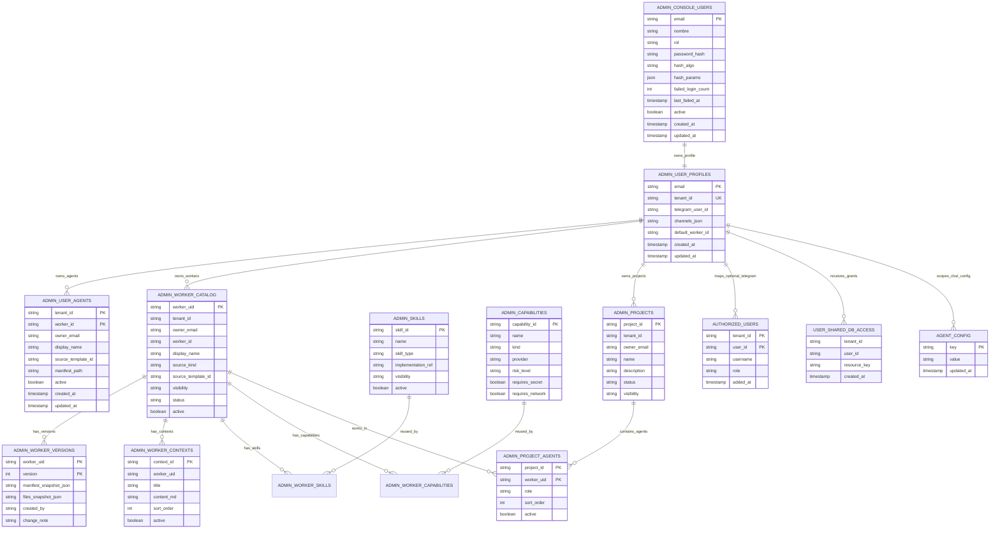
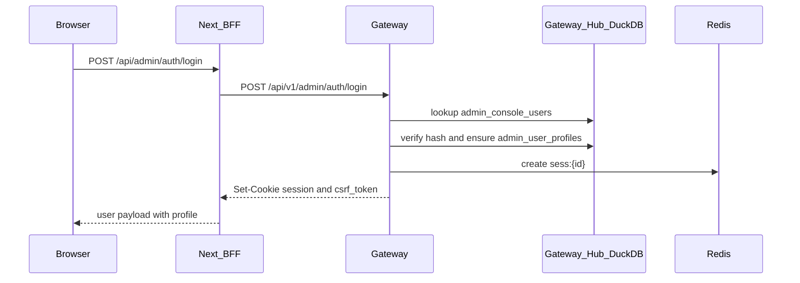

# Admin Identity, RBAC y Gateway Hub

Versión: 1.0 · Fecha: 2026-05-31

## Objetivo

Definir cómo DuckClaw Admin autentica usuarios, dónde se persisten roles/permisos y cómo se relacionan usuarios, tenants, canales y agentes runtime con el hub DuckDB del Gateway.

Relacionado:

- `specs/features/platform/ADMIN_CONSOLE_AUTH.md`
- `specs/features/platform/ADMIN_ACCESS_MANAGEMENT.md`
- `specs/features/platform/ADMIN_USER_AGENT_WORKSPACES.md`

## Conceptos

### Gateway Hub

El hub del Gateway es el archivo DuckDB activo resuelto por `duckclaw.gateway_db.get_gateway_db_path()`.

No es una “tabla padre” como tal. Es más parecido a una base de datos central o hub relacional donde viven tablas de control:

- Usuarios de consola.
- Perfiles operativos por usuario.
- Agentes runtime por tenant.
- Whitelist Telegram.
- Grants a bases compartidas.
- Configuración por chat/agente.

La ruta se resuelve en orden desde variables como:

1. `DUCKCLAW_WAR_ROOM_ACL_DB_PATH`
2. `DUCKCLAW_FINANZ_DB_PATH`
3. `DUCKCLAW_JOB_HUNTER_DB_PATH`
4. `DUCKCLAW_SIATA_DB_PATH`
5. `DUCKCLAW_QUANT_TRADER_DB_PATH`
6. `DUCKCLAW_PQRSD_ASSISTANT_DB_PATH`
7. `DUCKCLAW_AXIS_DB_PATH`
8. `DUCKDB_PATH`

### Identidad de Consola

La tabla `main.admin_console_users` es la fuente de verdad del login web:

- `email`: identificador del usuario.
- `rol`: `admin` o `user`.
- `password_hash`: hash Argon2id o PBKDF2 legacy.
- `hash_algo` y `hash_params`: metadata del algoritmo.
- `failed_login_count` y `last_failed_at`: seguridad de login.
- `active`: permite desactivar usuarios sin borrarlos.

No hay registro público en la pantalla de login. Los usuarios se crean por seed inicial o por un admin desde la API/vista de acceso.

### Perfil Operativo

La tabla `main.admin_user_profiles` conecta el usuario de consola con su contexto operativo:

- `email`: referencia lógica a `admin_console_users.email`.
- `tenant_id`: tenant único del usuario.
- `telegram_user_id`: identidad Telegram opcional.
- `channels_json`: canales configurados.
- `default_worker_id`: agente default del usuario.

### Agentes Runtime

La tabla `main.admin_user_agents` indexa agentes creados por usuarios:

- `tenant_id`: tenant dueño.
- `owner_email`: usuario dueño.
- `worker_id`: identificador del agente.
- `display_name`: nombre visible.
- `source_template_id`: template base usado como semilla.
- `manifest_path`: manifiesto runtime fuera de templates globales.
- `active`: permite ocultar/desactivar.

Los agentes de usuario no deben escribirse en `packages/agents/src/duckclaw/forge/templates`. Ese árbol queda como catálogo base del producto.

### Catálogo DB-First de Workers

El catálogo nuevo usa DuckDB como control plane de visibilidad y ownership:

- `main.admin_worker_catalog`: identidad actual del worker/agente. No guarda snapshots grandes.
- `main.admin_worker_versions`: snapshots importados de `manifest.yaml` y archivos relevantes.
- `main.admin_worker_contexts`: N contextos `.md` por worker, ordenables y activables.
- `main.admin_skills` / `main.admin_worker_skills`: skills reutilizables N:N.
- `main.admin_capabilities` / `main.admin_worker_capabilities`: capabilities reutilizables N:N.
- `main.admin_projects` / `main.admin_project_agents`: N agentes por proyecto.

Reglas:

- `default` es el único template global visible por defecto.
- Templates en disco distintos de `default` no se listan ni se ejecutan por la consola salvo que estén importados/asignados en BD.
- Importar un template es una copia lógica hacia DuckDB; no borra, mueve ni renombra carpetas.
- Los templates se pueden importar de forma selectiva por prefijo o nombre exacto para el owner/admin actual.
- Templates de otros devs quedan intactos y ocultos salvo import explícito.
- La autorización se resuelve por sesión, tenant, owner/asignación y catálogo DB, no por existencia de una carpeta.

Contrato Admin UI/API:

- `GET /api/v1/admin/templates` lista `default` + workers visibles desde `admin_worker_catalog`.
- `POST /api/v1/admin/templates/import` importa templates al catálogo por `include_prefixes` o `include_template_ids`.
- `GET /api/v1/admin/templates/{worker_id}` lee snapshots de workers DB-first desde `admin_worker_versions` y contextos activos desde `admin_worker_contexts`.
- `PUT /api/v1/admin/templates/{worker_id}/files/{file_path}` actualiza el snapshot DuckDB y sincroniza contextos `.md` sin escribir sobre carpetas físicas.
- `POST /api/v1/admin/templates/{worker_id}/contexts` crea un contexto `.md` activo para el worker visible del actor y lo agrega al último snapshot versionado.
- `PATCH /api/v1/admin/templates/{worker_id}/contexts/reorder` actualiza `sort_order` en `admin_worker_contexts` para controlar el orden de carga del contexto.
- `DELETE /api/v1/admin/templates/{worker_id}/contexts/{context_id}` desactiva lógicamente el contexto y lo remueve del snapshot vigente. No elimina archivos en disco.
- `DELETE /api/v1/admin/templates/{worker_id}` desactiva el registro del catálogo para el tenant/owner actual. No ejecuta `rmtree` ni toca carpetas del repo.
- La pantalla Admin `Workers` expone la importación genérica y muestra la acción como "desactivar del catálogo" para evitar ambigüedad operativa.

Contrato Proyectos DB-first:

- `GET /api/v1/admin/workspace/projects` lista proyectos visibles para el actor autenticado, incluyendo `agent_count` calculado desde `admin_project_agents`.
- `POST /api/v1/admin/workspace/projects` crea un proyecto en `admin_projects` para el tenant/perfil del actor, sin crear carpetas en `forge/projects`.
- `GET /api/v1/admin/workspace/projects/{project_id}/agents` lista los workers activos asignados al proyecto desde `admin_project_agents`.
- `POST /api/v1/admin/workspace/projects/{project_id}/agents` asigna un worker visible del catálogo al proyecto por `worker_id`; la relación persiste `worker_uid`, `role` y `sort_order`.
- `DELETE /api/v1/admin/workspace/projects/{project_id}/agents/{worker_id}` desactiva lógicamente la relación proyecto-worker. No borra el worker, sus versiones, contextos ni carpetas de templates.
- La pantalla Admin `Proyectos` separa proyectos DB-first de proyectos legacy en disco para evitar mezclar control plane relacional con metadata local.

Contrato Playground con proyecto:

- `GET /api/v1/admin/playground/config` incluye `projects[]` con proyectos visibles para el actor y sus `agents[]` activos desde `admin_project_agents`.
- `POST /api/v1/admin/playground/chat` acepta `project_id` opcional. Si viene, el Gateway valida que el proyecto sea visible para el actor y que `worker_id` pertenezca a ese proyecto.
- Si `project_id` viene y `worker_id=default` no está asignado al proyecto, el Gateway usa el primer agente activo del proyecto como worker efectivo.
- Si `worker_id` no pertenece al proyecto, el Gateway devuelve `403` antes de invocar runtime/LLM.
- La pantalla Admin `Playground` muestra selector de proyecto y filtra el selector de agentes al conjunto `admin_project_agents` del proyecto activo.

Contrato DuckDB Explorer:

- `GET /api/v1/admin/runtime/vaults` resuelve bóvedas desde el actor autenticado. El orden de resolución es: perfil `telegram_user_id`, admin principal (`DUCKCLAW_ADMIN_EMAIL` → `DUCKCLAW_OWNER_ID`) o `tenant_id` del perfil.
- `GET /api/v1/admin/duckdb/tables`, `POST /duckdb/query`, `GET /duckdb/pgq-graph` y `POST /duckdb/vector-search` usan la bóveda activa del actor cuando no se envía `vault_path`.
- Si se envía `vault_path`, el Gateway valida que pertenezca al namespace del actor (`db/private/<vault_user_id>` o shared autorizado) antes de abrirlo en modo `read_only=True`.
- La UI DuckDB debe mostrar `vault_user_id`, `tenant_id`, ruta efectiva y número de tablas visibles para evitar confundir la BD del usuario con el hub global.

## Modelo Entidad-Relación



## RBAC Recomendado

### `admin`

Puede:

- Crear y desactivar usuarios de consola.
- Cambiar roles.
- Ver auditoría y operaciones.
- Administrar grants y whitelist Telegram.
- Crear proyectos/global templates si se habilita explícitamente.

### `user`

Puede:

- Iniciar sesión.
- Usar Playground.
- Crear agentes runtime propios.
- Configurar su perfil operativo y canales.
- Ver solo sus agentes/tenant.

No debe:

- Administrar otros usuarios.
- Ejecutar ops PM2.
- Modificar `.env`.
- Modificar templates globales del repo.

## Alta de Usuarios

### Primer Admin

El primer admin se crea desde `.env` solo si `main.admin_console_users` está vacía:

```bash
DUCKCLAW_ADMIN_EMAIL=admin@example.com
DUCKCLAW_ADMIN_PASSWORD=change-me-min-8
```

Si la tabla ya tiene usuarios, cambiar `.env` no actualiza contraseñas ni crea nuevos usuarios. En ese caso se debe usar un comando de bootstrap/upsert controlado o la vista de gestión de acceso.

### Usuarios Delegados

Un admin debe poder crear usuarios con:

- email
- nombre
- rol (`admin` o `user`)
- contraseña temporal o flujo de invitación
- estado `active`

Al crear el usuario, el sistema debe asegurar también `main.admin_user_profiles` con tenant único.

## Flujo de Login



## Buenas Prácticas de Seguridad

- No exponer registro público sin invitación o control de admin.
- No guardar passwords en frontend ni `NEXT_PUBLIC_*`.
- Usar Argon2id para hashes nuevos.
- Mantener `session` como HttpOnly.
- Mantener CSRF double-submit para mutaciones BFF.
- Derivar rol/actor/tenant desde sesión server-side, no desde headers del browser.
- No usar contraseñas débiles ni compartidas.
- Rotar credenciales seed después del primer login.
